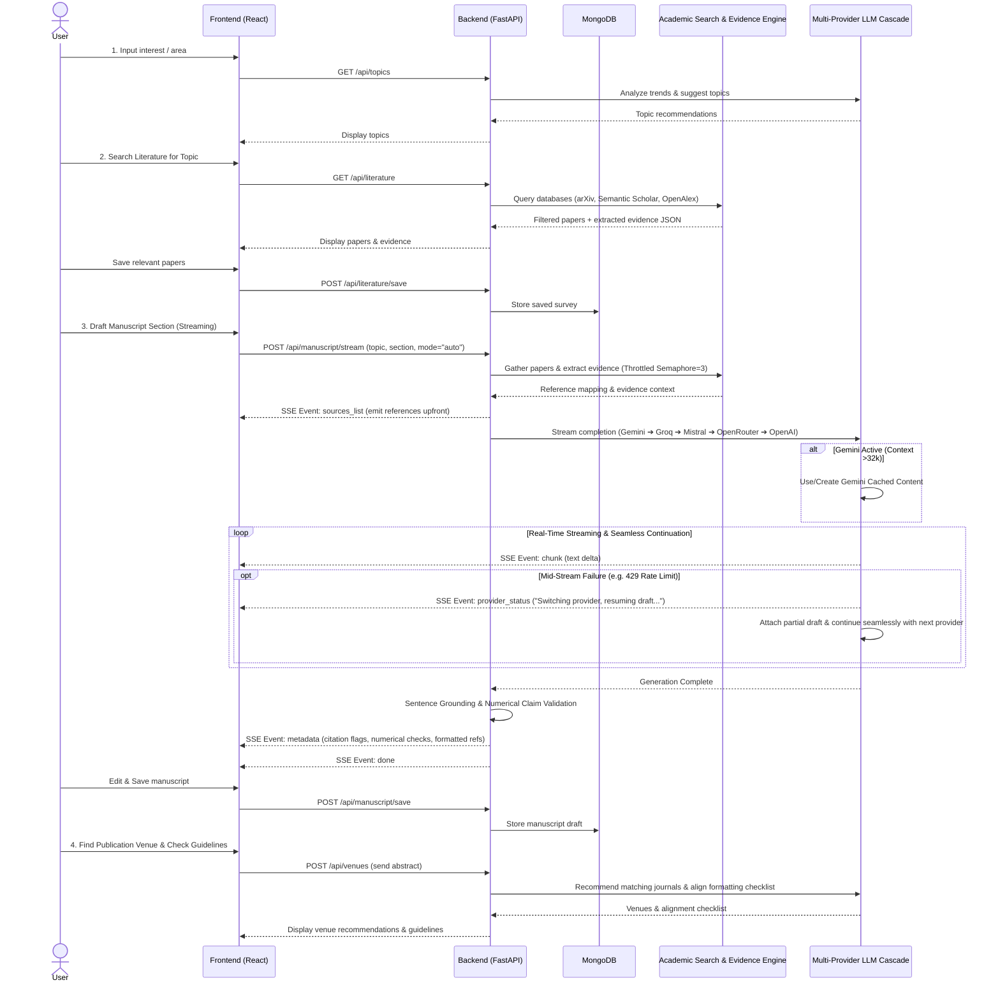

# System Architecture and Workflow

Here are the visual representations of how the Research Paper Guide system is structured and how data flows through it during a user's session.

## System Architecture

This diagram shows the major components: the React Frontend, the FastAPI Backend, the AI Engine with Multi-Provider Auto-Cascade, Knowledge Integrations, Database, and external AI services.

```mermaid
graph TD
    subgraph Frontend [Frontend - React + Vite]
        UI[User Interface & Manuscript Builder]
        SSE[SSE Stream Listener & Typewriter State]
    end

    subgraph Backend [Backend API - FastAPI]
        Router[API Routes / main.py]
        Auth[Authentication & Quotas]
      
        subgraph AI_Engine [AI Engine Modules]
            TD_AI[Topic Discovery]
            GA_AI[Gap Analysis]
            MG_AI[Manuscript Generation & Stream]
            LLM_P[LLM Provider & Auto-Cascade]
            Cache[Gemini Prompt Caching]
            VR_AI[Venue Recommendation]
            GR_AI[Citation Grounding & Numerical Validator]
        end
      
        subgraph Integrations [Knowledge Integrations]
            Search[Unified Search Engine]
            ArXiv[arXiv API]
            Crossref[Crossref API]
            SemanticScholar[Semantic Scholar API]
            OpenAlex[OpenAlex API]
            Evidence[Evidence Extractor - Grobid / LLM]
        end
    end

    subgraph Database [Database]
        MongoDB[(MongoDB)]
    end
  
    subgraph External_LLM [External AI Services - Cascade Fallback]
        Gemini[Google Gemini API - Cached]
        Groq[Groq API - Llama 3.3]
        Mistral[Mistral API - Large 2407]
        OpenRouter[OpenRouter API]
        OpenAI[OpenAI API - GPT-4o]
        NVIDIA[NVIDIA API]
        HF[HuggingFace API]
    end

    UI <-->|REST & SSE Stream| Router
    Router --> Auth
    Auth <-->|Verify Users & Usage Logs| MongoDB
  
    Router <-->|Delegates Streaming & Tasks| AI_Engine
    Router <-->|Delegates Literature Search| Integrations
  
    LLM_P <-->|1. Primary / Cached| Gemini
    LLM_P <-->|2. Fallback 1| Groq
    LLM_P <-->|3. Fallback 2| Mistral
    LLM_P <-->|4. Fallback 3| OpenRouter
    LLM_P <-->|5. Fallback 4| OpenAI
    LLM_P -.->|Optional| NVIDIA
    LLM_P -.->|Optional| HF
  
    AI_Engine <-->|Context Caching >32k tokens| Cache
    AI_Engine <-->|Validates Claims & Citations| GR_AI
  
    Integrations -.->|HTTP Requests| ArXiv
    Integrations -.->|HTTP Requests| Crossref
    Integrations -.->|HTTP Requests| SemanticScholar
    Integrations -.->|HTTP Requests| OpenAlex
    Integrations --> Evidence
  
    Router <-->|Save / Load Drafts, Surveys & Manuscripts| MongoDB
```

## End-to-End User Workflow

This sequence diagram illustrates the step-by-step journey of a researcher using the platform, from finding a topic to generating grounded manuscript sections with auto-cascading AI fallbacks.

