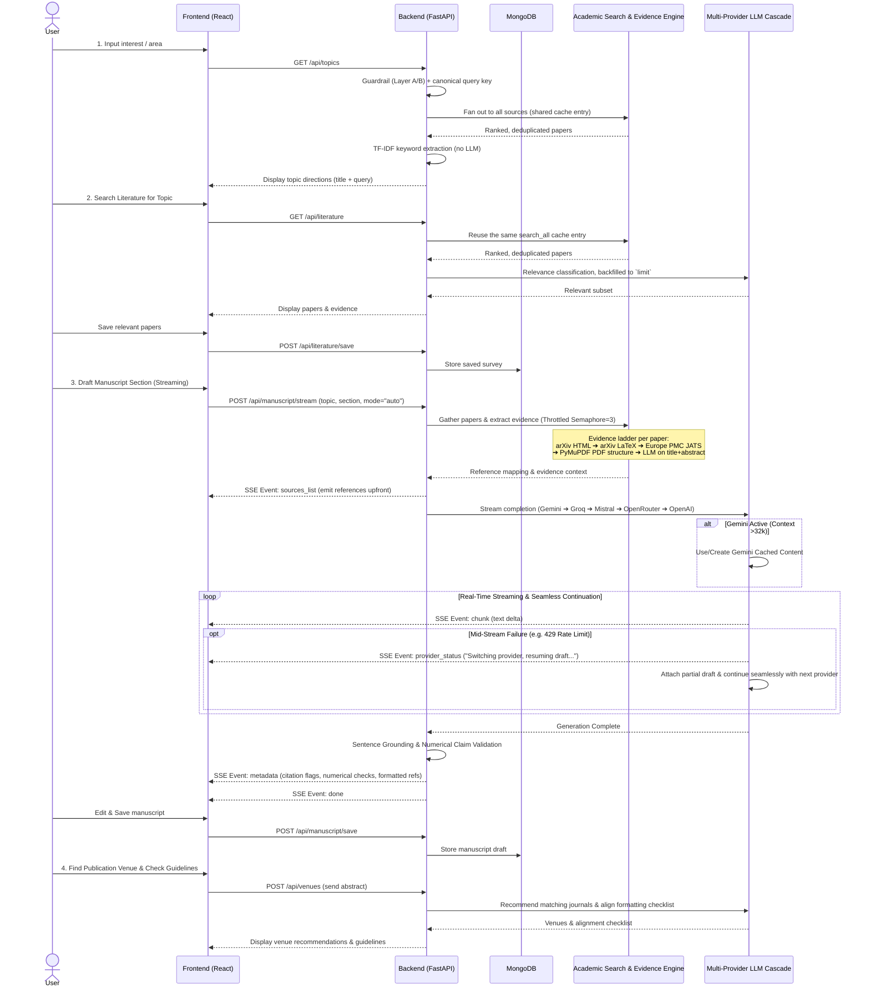
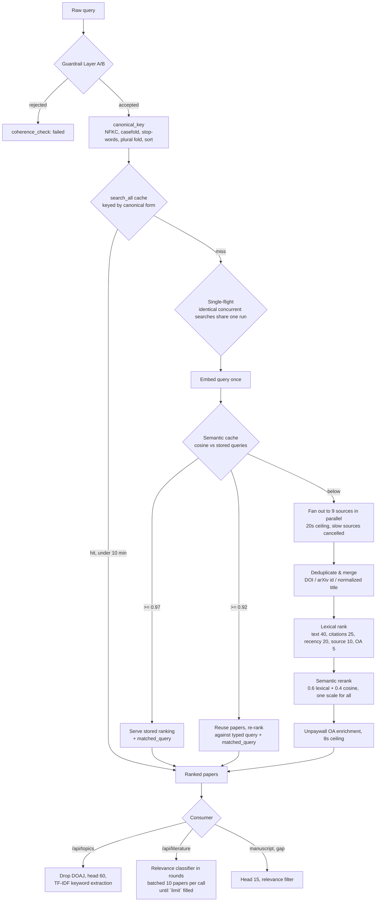
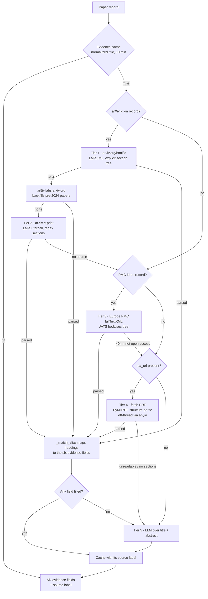

# System Architecture and Workflow

Here are the visual representations of how the Research Paper Guide system is structured and how data flows through it during a user's session.

## System Architecture

This diagram shows the major components: the React Frontend, the FastAPI Backend, the AI Engine with Multi-Provider Auto-Cascade, Knowledge Integrations, Database, and external AI services.

```mermaid
graph TD
    subgraph Frontend [Frontend - React + Vite]
        UI[User Interface & Manuscript Builder]
        SSE[SSE Stream Listener & Typewriter State]
    end

    subgraph Backend [Backend API - FastAPI]
        Router[API Routes / routers/*.py]
        Auth[Authentication & Quotas - core/ + services/]
      
        subgraph AI_Engine [AI Engine Modules]
            TD_AI[Topic Discovery]
            GA_AI[Gap Analysis]
            MG_AI[Manuscript Generation & Stream]
            LLM_P[LLM Provider & Auto-Cascade]
            Cache[Gemini Prompt Caching]
            VR_AI[Venue Recommendation]
            GR_AI[Citation Grounding & Numerical Validator]
        end
      
        subgraph Integrations [Knowledge Integrations]
            Search[Unified Search Engine - 9 sources]
            ArXiv[arXiv API]
            Crossref[Crossref API]
            SemanticScholar[Semantic Scholar API]
            OpenAlex[OpenAlex API - key required]
            PubMed[PubMed / NCBI API]
            EuropePMC[Europe PMC API]
            Springer[Springer Nature API]
            DOAJ[DOAJ API]
            GitHubKB[GitHub Knowledge Repos - local]
            Unpaywall[Unpaywall - OA enrichment]
        end

        subgraph Extraction [Document and Evidence Extraction]
            Ladder[Evidence Ladder - 5 tiers]
            AxHTML[arXiv LaTeXML HTML / ar5iv]
            AxTeX[arXiv LaTeX e-print]
            PMCXML[Europe PMC fullTextXML - JATS]
            PDFStruct[PyMuPDF Structure Parser - in-process]
        end
    end

    subgraph Database [Database]
        MongoDB[(MongoDB)]
    end
  
    subgraph External_LLM [External AI Services - Cascade Fallback]
        Gemini[Google Gemini API - Cached]
        Groq[Groq API - Llama 3.3]
        Mistral[Mistral API - Large 2407]
        OpenRouter[OpenRouter API]
        OpenAI[OpenAI API - GPT-4o]
        NVIDIA[NVIDIA API]
        HF[HuggingFace API]
    end

    UI <-->|REST & SSE Stream| Router
    Router --> Auth
    Auth <-->|Verify Users & Usage Logs| MongoDB
  
    Router <-->|Delegates Streaming & Tasks| AI_Engine
    Router <-->|Delegates Literature Search| Integrations
  
    LLM_P <-->|1. Primary / Cached| Gemini
    LLM_P <-->|2. Fallback 1| Groq
    LLM_P <-->|3. Fallback 2| Mistral
    LLM_P <-->|4. Fallback 3| OpenRouter
    LLM_P <-->|5. Fallback 4| OpenAI
    LLM_P -.->|Optional| NVIDIA
    LLM_P -.->|Optional| HF
  
    AI_Engine <-->|Context Caching >32k tokens| Cache
    AI_Engine <-->|Validates Claims & Citations| GR_AI
  
    Integrations -.->|Pooled HTTP, parallel fan-out| ArXiv
    Integrations -.->|Pooled HTTP, parallel fan-out| Crossref
    Integrations -.->|Pooled HTTP, parallel fan-out| SemanticScholar
    Integrations -.->|Pooled HTTP, parallel fan-out| OpenAlex
    Integrations -.->|Pooled HTTP, parallel fan-out| PubMed
    Integrations -.->|Pooled HTTP, parallel fan-out| EuropePMC
    Integrations -.->|Pooled HTTP, parallel fan-out| Springer
    Integrations -.->|Pooled HTTP, parallel fan-out| DOAJ
    Integrations -.->|Local corpus, no network| GitHubKB
    Integrations -.->|After dedupe| Unpaywall

    Integrations --> Ladder
    Ladder -->|1. cheapest, explicit sections| AxHTML
    Ladder -->|2. LaTeX source| AxTeX
    Ladder -->|3. open-access biomedical| PMCXML
    Ladder -->|4. any PDF| PDFStruct
    Ladder -.->|5. last resort| LLM_P
  
    Router <-->|Save / Load Drafts, Surveys & Manuscripts| MongoDB
```

> **No hosted document-parsing service.** The evidence ladder replaced a hosted
> GROBID tier in Aug 2026: every free instance was down (the HF Space returns
> 503) and GROBID is a JVM service needing several GB, which does not fit the
> deploy target. Tiers 1–4 are keyless, and tier 4 runs in-process, so an
> uploaded PDF no longer depends on any third party.

## End-to-End User Workflow

This sequence diagram illustrates the step-by-step journey of a researcher using the platform, from finding a topic to generating grounded manuscript sections with auto-cascading AI fallbacks.

```mermaid
sequenceDiagram
    actor User
    participant Front as Frontend (React)
    participant API as Backend (FastAPI)
    participant DB as MongoDB
    participant Sources as Academic Search & Evidence Engine
    participant Cascade as Multi-Provider LLM Cascade

    User->>Front: 1. Input interest / area
    Front->>API: GET /api/topics
    API->>API: Guardrail (Layer A/B) + canonical query key
    API->>Sources: Fan out to all sources (shared cache entry)
    Sources-->>API: Ranked, deduplicated papers
    API->>API: TF-IDF keyword extraction (no LLM)
    API-->>Front: Display topic directions (title + query)
  
    User->>Front: 2. Search Literature for Topic
    Front->>API: GET /api/literature
    API->>Sources: Reuse the same search_all cache entry
    Sources-->>API: Ranked, deduplicated papers
    API->>Cascade: Relevance classification, backfilled to `limit`
    Cascade-->>API: Relevant subset
    API-->>Front: Display papers & evidence
    User->>Front: Save relevant papers
    Front->>API: POST /api/literature/save
    API->>DB: Store saved survey
  
    User->>Front: 3. Draft Manuscript Section (Streaming)
    Front->>API: POST /api/manuscript/stream (topic, section, mode="auto")
    API->>Sources: Gather papers & extract evidence (Throttled Semaphore=3)
    Note over Sources: Evidence ladder per paper:<br/>arXiv HTML ➔ arXiv LaTeX ➔ Europe PMC JATS<br/>➔ PyMuPDF PDF structure ➔ LLM on title+abstract
    Sources-->>API: Reference mapping & evidence context
    API-->>Front: SSE Event: sources_list (emit references upfront)
  
    API->>Cascade: Stream completion (Gemini ➔ Groq ➔ Mistral ➔ OpenRouter ➔ OpenAI)
    alt Gemini Active (Context >32k)
        Cascade->>Cascade: Use/Create Gemini Cached Content
    end
  
    loop Real-Time Streaming & Seamless Continuation
        Cascade-->>Front: SSE Event: chunk (text delta)
        opt Mid-Stream Failure (e.g. 429 Rate Limit)
            Cascade-->>Front: SSE Event: provider_status ("Switching provider, resuming draft...")
            Cascade->>Cascade: Attach partial draft & continue seamlessly with next provider
        end
    end
  
    Cascade-->>API: Generation Complete
    API->>API: Sentence Grounding & Numerical Claim Validation
    API-->>Front: SSE Event: metadata (citation flags, numerical checks, formatted refs)
    API-->>Front: SSE Event: done
  
    User->>Front: Edit & Save manuscript
    Front->>API: POST /api/manuscript/save
    API->>DB: Store manuscript draft
  
    User->>Front: 4. Find Publication Venue & Check Guidelines
    Front->>API: POST /api/venues (send abstract)
    API->>Cascade: Recommend matching journals & align formatting checklist
    Cascade-->>API: Venues & alignment checklist
    API-->>Front: Display venue recommendations & guidelines
```

---

## Search & Retrieval Pipeline

Every section that needs prior work — Research Discovery, Literature Survey,
manuscript generation, gap analysis — enters through the same pipeline. Only
the window size and what happens to the result differ.

```mermaid
flowchart TD
    Q[Raw query] --> G{Guardrail Layer A/B}
    G -->|rejected| X[coherence_check: failed]
    G -->|accepted| K[canonical_key<br/>NFKC, casefold, stop-words, plural fold, sort]
    K --> C{search_all cache<br/>keyed by canonical form}
    C -->|hit, under 10 min| R[Ranked papers]
    C -->|miss| SF{Single-flight<br/>identical concurrent searches share one run}
    SF --> E[Embed query once]
    E --> SC{Semantic cache<br/>cosine vs stored queries}
    SC -->|>= 0.97| RV[Serve stored ranking<br/>+ matched_query]
    SC -->|>= 0.92| RR[Reuse papers, re-rank<br/>against typed query + matched_query]
    SC -->|below| F[Fan out to 9 sources in parallel<br/>20s ceiling, slow sources cancelled]
    RV --> R
    RR --> R
    F --> D[Deduplicate & merge<br/>DOI / arXiv id / normalized title]
    D --> L[Lexical rank<br/>text 40, citations 25, recency 20, source 10, OA 5]
    L --> S[Semantic rerank<br/>0.6 lexical + 0.4 cosine, one scale for all]
    S --> OA[Unpaywall OA enrichment, 8s ceiling]
    OA --> R
    R --> U{Consumer}
    U -->|/api/topics| T[Drop DOAJ, head 60,<br/>TF-IDF keyword extraction]
    U -->|/api/literature| V[Relevance classifier in rounds<br/>batched 10 papers per call<br/>until `limit` filled]
    U -->|manuscript, gap| W[Head 15, relevance filter]
```

### Source roster

Nine sources fan out in parallel. `SOURCE_NAMES` in `integrations/paper_search.py`
is the ordering, and per-database yield is reported back on `SearchMeta.sources`
so a source that timed out is distinguishable from one that returned nothing.

| Source | Key | Notes |
|---|---|---|
| Semantic Scholar | optional | Highest ranking weight |
| OpenAlex | **required since Feb 2026** | `OPENALEX_API_KEY`; ~$1/day free allowance |
| Crossref | no (polite `mailto`) | Also carries Retraction Watch data |
| PubMed / NCBI | optional | 5s budget |
| arXiv | no | Also the LaTeX/HTML source for extraction |
| Europe PMC | no | Also serves JATS full text |
| Springer Nature | yes | |
| DOAJ | no | Dropped for topic discovery — broad-OA noise skews keywords |
| GitHub Knowledge Repos | no | Local corpus, no network call |

Unpaywall runs *after* dedupe as OA enrichment, not as a search source.

**Two sources were removed rather than left to time out**, because each cost a
full per-source timeout and contributed zero papers:

| Removed | Why |
|---|---|
| BASE | Returns `<error>Access denied for IP address …</error>` — it allow-lists registered egress IPs, which a PaaS dyno does not have and cannot keep stable |
| CORE | Its own index returns HTTP 500: `not enough resources were available to cover 100% of the index` |

### Query identity

`core/query_key.py` is the single definition of "the same search".
`canonical()` reduces a query to a sorted set of stemmed content tokens, so
`"Machine Learning"`, `"machine learning"` and `"neural networks"` /
`"neural network"` resolve to one cache entry and one fan-out.

The canonical form is **cache identity only**. Outbound API calls, ranking and
everything the user sees use the original wording. `frontend/src/utils/searchHeuristics.js`
carries a byte-identical port so the client's in-flight dedupe guard and the
server cache agree; `ai/keyword_extractor.py` imports `GRAMMAR_STOPS` and
`stem` from the same module so tokenisation cannot drift.

### Semantic cache

Canonical keys collapse wording; they cannot collapse synonyms. `"CNN
classification"` and `"convolutional neural network classification"` are one
search to a researcher and two full fan-outs to the canonical key.
`services/semantic_cache.py` closes that gap by keying on the query
*embedding* — which the rerank step needs anyway, so a true miss pays nothing
extra for the lookup.

Two tiers, both conservative:

| Cosine | Behaviour |
|---|---|
| >= 0.97 (`VERBATIM_THRESHOLD`) | Serve the stored ranking untouched |
| >= 0.92 (`RERANK_THRESHOLD`) | Reuse the stored *papers*, re-rank them against the query actually typed |
| below | Miss — run the real search |

The middle tier carries most of the value: re-ranking costs no network call
(paper embeddings are already cached by content digest) and guarantees the
ordering matches what the user asked for, so a near-miss degrades into a
slightly different candidate pool rather than answers to someone else's
question.

Entries are bucketed by fan-out parameters, so a `limit=5` search can never be
served from a `limit=50` entry, and the store is capped and TTL-pruned.

**Disclosure is mandatory.** Every hit sets `matched_query` on the response and
the UI renders "Showing results for X — search instead for Y". The escape hatch
re-requests with `fresh=true`, which bypasses the semantic tier. A cached
answer to a question the user did not ask is only acceptable when the
substitution is visible and reversible.

Single-flight wraps the *entire* resolve path, embedding lookup included:
awaiting anything between the exact-cache check and in-flight registration lets
two concurrent identical searches both miss and both fan out.

Thresholds are measured, not guessed — `backend/scripts/eval_semantic_cache.py`
replays labelled query pairs and reports the false-hit rate across a threshold
sweep. Add a pair whenever a bad substitution is seen in the product; the list
is this cache's regression suite.

### Deduplication

A record is recognised by **any** of three identifiers: DOI, arXiv id, or full
normalized title. Matching records are *merged*, not discarded — the
higher-cited record wins field conflicts (it is usually the published version,
with better metadata) while the other fills in whatever the winner lacks
(usually the preprint's free `pdf_url`). Merging is transitive: a preprint
known only by arXiv id joins its published version through their shared title.

Records with no DOI, no arXiv id and no title are dropped — they cannot be
deduplicated, cited or opened.

### Ranking

Lexical scoring runs over every deduplicated paper. Semantic reranking then
embeds the query once and the top `RERANK_WINDOW` papers in one batched
request, and **every** paper is scored on the same `0.6·lexical + 0.4·semantic`
scale, with semantic = 0 where it is unknown. Mixing scales across the window
boundary previously let an unreranked paper outrank a better one purely
because it had never been embedded.

### Relevance filtering and backfill

`/api/literature` classifies papers in ranked order in rounds of
`limit + _BACKFILL_HEADROOM` until `limit` relevant papers are collected or the
corpus runs out. Cost stays proportional to what is returned rather than to the
corpus, and `limit` means what it says even when the ranked head is noisy.
`has_more` reports whether unexamined papers remain.

Papers are judged a page at a time: one prompt carries ten numbered papers and
the reply is one `<n>: yes|no` line each. That turns a 100-paper survey from
~34 serial round-trips through `Semaphore(3)` into 4, and it was the single
largest cost in the search path. A reply that cannot be aligned to the papers
is **rejected outright** and the page falls back to per-paper calls — slower,
but a partial parse would assign one paper's verdict to another.

Classifier failures fail **open** — the paper is included — and the failure is
cached briefly, so a rate-limited provider is not re-hammered once per paper on
every retry.

### Caches

| Cache | Key | TTL | Scope |
|---|---|---|---|
| `search_all` results | canonical query + fan-out params | 10 min | process |
| In-flight searches | same key | request | process |
| Paper embeddings | blake2b digest of title + abstract | 10 min / 1 min on failure | process |
| Semantic query results | query embedding, cosine-matched | 10 min | process |
| Relevance verdicts | canonical topic + normalized title | 10 min | process |
| Classifier failures | same key | 1 min | process |
| Extracted evidence | normalized title prefix | 10 min | process |
| arXiv category feed | category + limit | 15 min | process |
| Gemini context cache | prompt cache key | 30 min | provider |

Every cache is a `core.ttl_cache.TTLCache`: expiry on read *and* an LRU
capacity ceiling. They were plain dicts that grew for the lifetime of the
process — an entry nobody looked up again was never released, and paper
embeddings are 3072 floats each.

The TTLs above are *retention* ceilings. Where a shorter freshness rule
applies it is enforced at the call site and remains authoritative — search
results are deliberately readable past their 10-minute freshness window so a
total source outage can fall back to a stale entry rather than return nothing.

All search caches are per-process and in-memory. With more than one worker each
holds its own copy. `TTLCache` is the seam where a Redis backend goes: the call
sites already speak only its interface.

### HTTP connection pooling

Every integration used to construct its own `httpx.AsyncClient` per call, so a
single search paid one TCP handshake and one TLS negotiation per source. They
now share one pooled client (`integrations/http_client.py`) with keep-alive,
closed on app shutdown via the lifespan.

Per-source settings that used to live on the client — User-Agent, timeout —
are per-*source*, not per-connection, so `pooled_client(headers=..., timeout=...)`
applies them as per-request defaults instead. That keeps each source's latency
budget (PubMed 5s, arXiv 15s) while they all share one pool.

### Rate limits and guardrails

`/api/topics` and `/api/literature` trigger the same fan-out and both carry
`5/minute` — throttling only one let the other keep burning source quota after
the limit tripped. Layer A/B validation runs on `/api/topics`,
`/api/literature`, `/api/arxiv/search` and `/api/github/search`; a rejected
query returns `coherence_check: "failed"` and never reaches a source.

Layer A scores each word token separately rather than the whitespace-stripped
query — concatenating words invented consonant runs across word boundaries
(`"CNN classification"` → `"CNNcl"`) and rejected ordinary acronym queries as
keyboard mash.

---

## Document & Evidence Extraction

Turning a paper into the six evidence fields (`objective`, `method`, `dataset`,
`results`, `limitations`, `future_work`) is a ladder, not a single parser. Each
rung is tried only when the one above it has nothing to give, so the common case
never downloads a PDF and the LLM is a last resort rather than the default.

```mermaid
flowchart TD
    P[Paper record] --> C{Evidence cache<br/>normalized title, 10 min}
    C -->|hit| DONE[Six evidence fields<br/>+ source label]

    C -->|miss| AX{arXiv id on record?}
    AX -->|yes| H[Tier 1 - arxiv.org/html/id<br/>LaTeXML, explicit section tree]
    H -->|404| A5[ar5iv.labs.arxiv.org<br/>backfills pre-2024 papers]
    A5 -->|none| TEX[Tier 2 - arXiv e-print<br/>LaTeX tarball, regex sections]
    H -->|parsed| MAP
    A5 -->|parsed| MAP
    TEX -->|parsed| MAP

    AX -->|no| PM{PMC id on record?}
    TEX -->|no source| PM
    PM -->|yes| JATS[Tier 3 - Europe PMC fullTextXML<br/>JATS body/sec tree]
    JATS -->|parsed| MAP
    JATS -->|404 = not open access| OA

    PM -->|no| OA{oa_url present?}
    OA -->|yes| PDF[Tier 4 - fetch PDF<br/>PyMuPDF structure parse<br/>off-thread via anyio]
    PDF -->|parsed| MAP
    PDF -->|unreadable / no sections| LLM
    OA -->|no| LLM[Tier 5 - LLM over title + abstract]

    MAP[_match_alias maps headings<br/>to the six evidence fields] --> Q{Any field filled?}
    Q -->|yes| STORE[Cache with its source label]
    Q -->|no| LLM
    LLM --> STORE
    STORE --> DONE
```

The `source` label returned alongside the evidence (`arxiv-html`,
`arxiv-latex`, `europepmc-fulltext`, `pdf-structure`, `llm-fallback`, `none`) is
what makes the tier visible in logs and in the admin view — a corpus silently
answered entirely from tier 5 looks identical to a well-grounded one otherwise.

### Why the ladder is ordered this way

Cost and fidelity move together here, which is unusual and worth stating: the
cheapest rungs are also the most accurate.

| Tier | Network | Structure quality |
|---|---|---|
| arXiv HTML | one GET | Explicit `<section>` tree — nothing inferred |
| arXiv LaTeX | one GET + untar | Sections from `\section{}`, macros unresolved |
| Europe PMC JATS | one GET | Explicit `<body><sec><title>` tree |
| PDF structure | GET + parse | Headings *inferred* from font size and layout |
| LLM | provider call | Title + abstract only; no full text at all |

### PDF structure parsing

`ai/pdf_structure.py` is the only tier that has to guess. It reads PyMuPDF's
span dictionary, takes the modal font size as the body size, and treats short
larger-or-bold lines as headings. Three corrections make that usable rather than
merely plausible:

- **Rotated spans are dropped.** The arXiv sidebar stamp is the largest text on
  page 1 and would otherwise be selected as the title.
- **Running headers are removed** by tallying blocks whose *digit-stripped* text
  recurs on three or more pages. Matching on exact text fails because the header
  carries the page number, which is why one paper previously reported 111
  "sections".
- **Numbering is stripped and subsections folded into their parent**, so
  `3.1 Encoder and Decoder Stacks` joins `method` instead of becoming a
  top-level key no alias could ever match.

Authors are recovered from the blocks between the title and the abstract
heading, cut at the first affiliation or email token, then split greedily (two
capitalised tokens, or three when the middle one is an initial). This is
best-effort: it is correct on ordinary `First Last` and `First M. Last` lists,
and truncates three-token given names.

Measured on four papers with distinct layouts:

| Paper | Sections | Authors |
|---|---|---|
| Attention Is All You Need | 9 | 8 / 8 |
| GPT-3 | 20 | 15 / 15 |
| BERT | 11 | 4 / 4 |
| CLIP (two-column) | 30 | 11 / 12 |

### Heading vocabulary

`SECTION_ALIASES` in `ai/pdf_extraction.py` maps headings onto the six evidence
fields, and `_match_alias` strips a leading number before matching so
`2 Background`, `II. Background` and `Background` are one heading across all
four tiers. The table has to cover discipline-specific naming: ML papers label
their methods section *Model Architecture* or *Approach* rather than *Methods*,
and until those aliases existed the Transformer paper mapped no `method`
evidence at all despite parsing perfectly.
