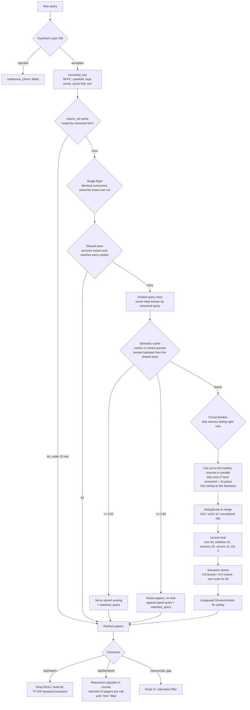
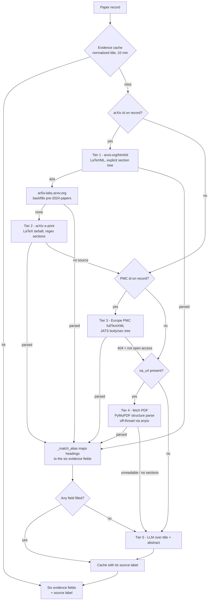

# System Architecture and Workflow

Here are the visual representations of how the Research Paper Guide system is structured and how data flows through it during a user's session.

## System Architecture

This diagram shows the major components: the React Frontend, the FastAPI Backend, the AI Engine with Multi-Provider Auto-Cascade, Knowledge Integrations, Database, and external AI services.

```mermaid
graph TD
    subgraph Frontend [Frontend - React + Vite]
        UI[User Interface & Manuscript Builder]
        SSE[SSE Stream Listener & Typewriter State]
        ApiClient[One API client - lib/api.js + query cache]
    end

    subgraph Backend [Backend API - FastAPI]
        subgraph Edge [Middleware - outermost first]
            CORS[CORS - trimmed origin allowlist]
            BodyCap[Body size cap - 16MB, pre-buffer]
            RateLimit[Rate limiter - default on every route]
            Headers[Security headers + CSP]
        end
        Router[API Routes / routers/*.py]
        Auth[Authentication & Quotas - core/ + services/]
        Refresh[Refresh rotation + reuse detection - 1.14]
        Verify[Email verification + reset - separate signing keys]
        SSRF[SSRF guard - pinned IP, ports 80/443]
        Consent[Third-party processing consent - 1.16]

        subgraph SelfHeal [API self-heal]
            Registry[Source registry - one fan-out list]
            Health[Rolling health window + circuit breaker]
            Retry[One retry policy - Retry-After + jitter]
        end

        subgraph Caches [Cache tiers]
            L1[In-process TTLCache / semantic cache]
            L2[Shared store - Mongo, survives restart - 1.2]
            Emb[(paper_embeddings - kept forever - 1.3)]
        end

        subgraph Research [Background research - 1.5]
            Jobs[research_jobs - persisted stages]
            Corpus[prepare_corpus - search, screen, evidence]
        end
      
        subgraph AI_Engine [AI Engine Modules]
            TD_AI[Topic Discovery]
            GA_AI[Gap Analysis]
            MG_AI[Manuscript Generation & Stream]
            LLM_P[LLM Provider & Auto-Cascade]
            Cache[Gemini Prompt Caching]
            VR_AI[Venue Recommendation]
            GR_AI[Citation Grounding & Numerical Validator]
        end
      
        subgraph Integrations [Knowledge Integrations]
            Search[Unified Search Engine - 9 sources]
            ArXiv[arXiv API]
            Crossref[Crossref API]
            SemanticScholar[Semantic Scholar API]
            OpenAlex[OpenAlex API - key required]
            PubMed[PubMed / NCBI API]
            EuropePMC[Europe PMC API]
            Springer[Springer Nature API]
            DOAJ[DOAJ API]
            GitHubKB[GitHub Knowledge Repos - local]
            Unpaywall[Unpaywall - OA enrichment]
        end

        subgraph Extraction [Document and Evidence Extraction]
            Ladder[Evidence Ladder - 5 tiers]
            AxHTML[arXiv LaTeXML HTML / ar5iv]
            AxTeX[arXiv LaTeX e-print]
            PMCXML[Europe PMC fullTextXML - JATS]
            PDFStruct[PyMuPDF Structure Parser - in-process]
        end
    end

    subgraph Database [Database]
        MongoDB[(MongoDB)]
    end
  
    subgraph External_LLM [External AI Services - Cascade Fallback]
        Gemini[Google Gemini API - Cached]
        Groq[Groq API - Llama 3.3]
        Mistral[Mistral API - Large 2407]
        OpenRouter[OpenRouter API]
        OpenAI[OpenAI API - GPT-4o]
        NVIDIA[NVIDIA API]
        HF[HuggingFace API]
    end

    UI --> ApiClient
    ApiClient <-->|REST & SSE Stream| CORS
    CORS --> BodyCap
    BodyCap --> RateLimit
    RateLimit --> Headers
    Headers --> Router
    Router --> Auth
    Auth --> Verify
    Auth --> Refresh
    Refresh <-->|Token families, reuse detection| MongoDB
    Auth <-->|Verify Users & Usage Logs - 60s user cache| MongoDB
    Router -->|User-supplied URLs & OA PDFs| SSRF
    Router -->|PDF upload| Consent
    Consent -.->|Only with explicit consent| Extraction
  
    Router <-->|Delegates Streaming & Tasks| AI_Engine
    Router <-->|Delegates Literature Search| Integrations
  
    LLM_P <-->|1. Primary / Cached| Gemini
    LLM_P <-->|2. Fallback 1| Groq
    LLM_P <-->|3. Fallback 2| Mistral
    LLM_P <-->|4. Fallback 3| OpenRouter
    LLM_P <-->|5. Fallback 4| OpenAI
    LLM_P -.->|Optional| NVIDIA
    LLM_P -.->|Optional| HF
  
    AI_Engine <-->|Context Caching >32k tokens| Cache
    AI_Engine <-->|Validates Claims & Citations| GR_AI
  
    Integrations -.->|Pooled HTTP, parallel fan-out| ArXiv
    Integrations -.->|Pooled HTTP, parallel fan-out| Crossref
    Integrations -.->|Pooled HTTP, parallel fan-out| SemanticScholar
    Integrations -.->|Pooled HTTP, parallel fan-out| OpenAlex
    Integrations -.->|Pooled HTTP, parallel fan-out| PubMed
    Integrations -.->|Pooled HTTP, parallel fan-out| EuropePMC
    Integrations -.->|Pooled HTTP, parallel fan-out| Springer
    Integrations -.->|Pooled HTTP, parallel fan-out| DOAJ
    Integrations -.->|Local corpus, cloned at deploy| GitHubKB
    Integrations -.->|After dedupe| Unpaywall

    Integrations --> Ladder
    Ladder -->|1. cheapest, explicit sections| AxHTML
    Ladder -->|2. LaTeX source| AxTeX
    Ladder -->|3. open-access biomedical| PMCXML
    Ladder -->|4. any PDF| PDFStruct
    Ladder -.->|5. last resort| LLM_P

    Integrations --> Registry
    Registry -->|Skip a source whose circuit is open| Health
    Registry -->|Retry only what a retry can fix| Retry
    Health -.->|Fed by every tracked call| Integrations

    Integrations <--> L1
    L1 -->|Miss| L2
    L2 <--> MongoDB
    L2 <--> Emb
    Emb <--> MongoDB

    Router -->|Topic known: warm the corpus| Jobs
    Jobs --> Corpus
    Corpus --> Integrations
    Corpus -->|Prepared corpus| L2
    Jobs <-->|Persisted stages, replayed on reconnect| MongoDB
    MG_AI -->|Reads the prepared corpus| L2

    Router <-->|Save / Load Drafts, Surveys & Manuscripts| MongoDB
    Router <-->|Version history + restore - 1.10| MongoDB
```

> **No hosted document-parsing service.** The evidence ladder replaced a hosted
> GROBID tier in Aug 2026: every free instance was down (the HF Space returns
> 503) and GROBID is a JVM service needing several GB, which does not fit the
> deploy target. Tiers 1–4 are keyless, and tier 4 runs in-process, so an
> uploaded PDF no longer depends on any third party.

> **Nothing clones on a request.** The GitHub knowledge repos are checked out
> into `backend/data/` by `python -m scripts.sync_github_repos` at build time.
> Until Aug 2026 `POST /api/github/sync` shelled out to `git clone` inside a
> request handler, so any signed-in user could hold a worker for minutes and
> write hundreds of megabytes of container disk on demand. That route is gone;
> the remaining `/api/github/*` routes only read what the deploy left on disk.

### Request-safety layers

Every request crosses four middleware layers before a route sees it, ordered so
that a rejection still carries CORS headers — a 429 or 413 without them reaches
the browser as an unexplained network failure rather than a reason.

| Layer | Rejects | Configured by |
|---|---|---|
| CORS | Unknown origin | `CORS_ORIGINS` |
| Body cap | `Content-Length` over the ceiling, and a chunked body that exceeds it mid-stream | `MAX_REQUEST_BODY_BYTES` (16MB) |
| Rate limit | Over-budget caller, keyed on user id then client address | `DEFAULT_RATE_LIMIT`, `TRUSTED_PROXY_HOPS` |
| Security headers | — (adds CSP, HSTS, nosniff, frame-deny) | `core/config.SECURITY_HEADERS` |

`TRUSTED_PROXY_HOPS` **must** be set to the number of proxies in front of the
app (1 on Render). At the default of 0 the header is ignored and every
anonymous caller shares one bucket, because behind a proxy `request.client.host`
is the proxy for all of them. Reading the leftmost `X-Forwarded-For` entry
instead would be worse: that part of the chain is caller-supplied, so anyone
could mint a fresh bucket per request.

### Token classes

Three token classes, each with its own signing key, audience and `purpose`
claim. A reset link used to be signed with the session key and `purpose` was
never checked on decode, so pasting the token from a reset email into an
`Authorization` header was a full login.

| Token | Key | Audience | Lifetime |
|---|---|---|---|
| Session (access) | `JWT_SECRET_KEY` | `research-agent:access` | 1h (`ACCESS_TOKEN_EXPIRE_HOURS`) |
| Refresh | `JWT_REFRESH_SECRET_KEY`, else derived | `research-agent:refresh` | 14d (`REFRESH_TOKEN_EXPIRE_DAYS`) |
| Password reset | `JWT_RESET_SECRET_KEY`, else derived by HMAC from the session key | `research-agent:password-reset` | 30 min |
| Email verification | `JWT_VERIFY_SECRET_KEY`, else derived | `research-agent:email-verify` | 24h |

The derived keys mean no new environment variable is needed to deploy, while
each can still be pinned for independent rotation.

### Refresh rotation and reuse detection (1.14)

A 24-hour bearer token was a 24-hour window for anything that got hold of one:
nothing but an explicit logout could end it early. The session is now a short
access token plus a long **rotating** refresh token.

```mermaid
sequenceDiagram
    participant C as Client
    participant A as API
    participant DB as refresh_tokens

    C->>A: POST /api/auth/login
    A->>DB: Record jti₁ (family F, used=false)
    A-->>C: access (1h) + refresh jti₁

    Note over C,A: Access token expires; authFetch rotates once and replays.
    C->>A: POST /api/auth/refresh (jti₁)
    A->>DB: Write jti₂ first, then mark jti₁ used → jti₂
    A-->>C: new access + refresh jti₂

    Note over C,A: The successor is written before the predecessor is retired,<br/>so a crash between the two leaves a token that still works.

    rect rgb(250, 235, 235)
        C--xA: POST /api/auth/refresh (jti₁ — already spent)
        A->>DB: Revoke every token in family F
        A-->>C: 401 — both holders must sign in again
    end
```

A spent refresh token being presented again means two parties hold it, and
there is no way to tell which one is asking. Revoking the family is the OAuth
2.0 BCP treatment and the whole reason rotation is worth having. Logout and
admin suspension revoke the family too — blacklisting the bearer token alone
would leave the refresh token minting new ones.

`get_current_user` reads the `users` document from a 60-second cache rather than
on every request; role changes, suspension and deletion invalidate it
explicitly, so a demotion takes effect immediately rather than a minute later.

## End-to-End User Workflow

This sequence diagram illustrates the step-by-step journey of a researcher using the platform, from finding a topic to generating grounded manuscript sections with auto-cascading AI fallbacks.

```mermaid
sequenceDiagram
    actor User
    participant Front as Frontend (React)
    participant API as Backend (FastAPI)
    participant DB as MongoDB
    participant Sources as Academic Search & Evidence Engine
    participant Cascade as Multi-Provider LLM Cascade
    participant Mail as Brevo (email)

    User->>Front: 0. Sign up
    Front->>API: POST /api/auth/signup
    API->>DB: Create account with email_verified=false
    API->>Mail: Verification link (24h, separate signing key)
    API-->>Front: "Check your email" — no session token
    Note over API,DB: The account cannot sign in yet. This is what stops<br/>someone registering with an address they do not own<br/>and inheriting the session when its real owner<br/>later signs in with Google.
    User->>Front: Click the emailed link
    Front->>API: POST /api/auth/verify-email
    API->>DB: email_verified=true, bump token version (single use)
    API-->>Front: Session token — signed in

    User->>Front: 1. Input interest / area
    Front->>API: GET /api/topics
    API->>API: Guardrail (Layer A/B) + canonical query key
    API->>Sources: Fan out to all sources (shared cache entry)
    Sources-->>API: Ranked, deduplicated papers
    API->>API: TF-IDF keyword extraction (no LLM)
    API-->>Front: Display topic directions (title + query)
  
    User->>Front: 2. Search Literature for Topic
    Front->>API: GET /api/literature
    API->>Sources: Reuse the same search_all cache entry
    Sources-->>API: Ranked, deduplicated papers
    API->>Cascade: Relevance classification, backfilled to `limit`
    Cascade-->>API: Relevant subset
    API-->>Front: Display papers & evidence
    User->>Front: Save relevant papers
    Front->>API: POST /api/literature/save
    API->>DB: Store saved survey
  
    Note over Front,API: As soon as the topic settles, the corpus is built in the<br/>background (1.5) — so by the time Generate is pressed the<br/>fan-out, screening and full-text fetches are already done.
    Front->>API: POST /api/manuscript/research/prepare (topic)
    API->>DB: research_jobs — one run per topic, stages persisted
    API->>Sources: search ➔ screen ➔ evidence
    API->>DB: Prepared corpus into the shared cache (1h)
    API-->>Front: "Research ready"

    User->>Front: 3. Draft Manuscript Section (Streaming)
    Front->>API: POST /api/manuscript/stream (topic, section, mode="auto")
    alt Corpus already prepared
        API->>DB: Read the prepared corpus — no fan-out
    else Cold topic
        API->>Sources: Gather papers & extract evidence (Throttled Semaphore=3)
        API-->>Front: SSE Event: status (search ➔ screen ➔ evidence, live)
    end
    Note over Sources: Evidence ladder per paper:<br/>arXiv HTML ➔ arXiv LaTeX ➔ Europe PMC JATS<br/>➔ PyMuPDF PDF structure ➔ LLM on title+abstract
    Sources-->>API: Reference mapping & evidence context
    Note over API: Titles, abstracts, evidence, URLs and the user's own<br/>uploads go into the prompt inside &lt;sources&gt;, with any<br/>forged delimiter defused and a system rule saying the<br/>delimited regions are data, never instructions.
    API-->>Front: SSE Event: sources_list (emit references upfront)
  
    API->>Cascade: Stream completion (Gemini ➔ Groq ➔ Mistral ➔ OpenRouter ➔ OpenAI)
    alt Gemini Active (Context >32k)
        Cascade->>Cascade: Use/Create Gemini Cached Content
    end
  
    loop Real-Time Streaming & Seamless Continuation
        Cascade-->>Front: SSE Event: chunk (text delta)
        opt Mid-Stream Failure (e.g. 429 Rate Limit)
            Cascade-->>Front: SSE Event: provider_status ("Switching provider, resuming draft...")
            Cascade->>Cascade: Attach partial draft & continue seamlessly with next provider
        end
    end
  
    Cascade-->>API: Generation Complete
    API->>API: Sentence Grounding & Numerical Claim Validation
    API->>API: Citation index check — every [N] must name a real reference
    API-->>Front: SSE Event: metadata (citation flags, invalid citations, numerical checks, formatted refs)
    API-->>Front: SSE Event: done
  
    User->>Front: Edit & Save manuscript
    Front->>API: POST /api/manuscript/save
    API->>DB: Snapshot the state being replaced into manuscript_versions (1.10)
    API->>DB: Store manuscript draft
    opt Undo a bad save
        Front->>API: POST /api/manuscript/restore (version_id)
        API->>DB: Snapshot current, then write the version back
        API-->>Front: Restored draft — the restore is itself undoable
    end
  
    User->>Front: 4. Find Publication Venue & Check Guidelines
    Front->>API: POST /api/venues (send abstract)
    API->>Cascade: Recommend matching journals & align formatting checklist
    Cascade-->>API: Venues & alignment checklist
    API-->>Front: Display venue recommendations & guidelines
```

---

## Search & Retrieval Pipeline

Every section that needs prior work — Research Discovery, Literature Survey,
manuscript generation, gap analysis — enters through the same pipeline. Only
the window size and what happens to the result differ.

```mermaid
flowchart TD
    Q[Raw query] --> G{Guardrail Layer A/B}
    G -->|rejected| X[coherence_check: failed]
    G -->|accepted| K[canonical_key<br/>NFKC, casefold, stop-words, plural fold, sort]
    K --> C{search_all cache<br/>keyed by canonical form}
    C -->|hit, under 10 min| R[Ranked papers]
    C -->|miss| SF{Single-flight<br/>identical concurrent searches share one run}
    SF --> SH{Shared store<br/>survives restart and reaches every worker}
    SH -->|hit| R
    SH -->|miss| E[Embed query once<br/>vector kept forever by canonical query]
    E --> SC{Semantic cache<br/>cosine vs stored queries<br/>bucket hydrated from the shared store}
    SC -->|>= 0.97| RV[Serve stored ranking<br/>+ matched_query]
    SC -->|>= 0.92| RR[Reuse papers, re-rank<br/>against typed query + matched_query]
    SC -->|below| CB{Circuit breaker<br/>skip sources failing right now}
    CB --> F[Fan out to the healthy sources in parallel<br/>stop once 5 have answered + 3s grace<br/>20s ceiling as the backstop]
    RV --> R
    RR --> R
    F --> D[Deduplicate & merge<br/>DOI / arXiv id / normalized title]
    D --> L[Lexical rank<br/>text 40, citations 25, recency 20, source 10, OA 5]
    L --> S[Semantic rerank<br/>0.6 lexical + 0.4 cosine, one scale for all]
    S --> OA[Unpaywall OA enrichment, 8s ceiling]
    OA --> R
    R --> U{Consumer}
    U -->|/api/topics| T[Drop DOAJ, head 60,<br/>TF-IDF keyword extraction]
    U -->|/api/literature| V[Relevance classifier in rounds<br/>batched 10 papers per call<br/>until `limit` filled]
    U -->|manuscript, gap| W[Head 15, relevance filter]
```

### Cache tiers

Three, and only the first is per-worker:

| Tier | Where | Holds | Lifetime |
|---|---|---|---|
| L1 | `TTLCache` / `semantic_cache` in process | Search results, semantic entries, relevance verdicts | Minutes; dies with the worker |
| L2 | `cache_entries` in Mongo (`core/shared_store.py`) | The same, shared across workers and across deploys | 10 min (search) to 6h (relevance verdicts) |
| Embeddings | `paper_embeddings` in Mongo | Vectors keyed by DOI → arXiv id → title, and by canonical query | **No expiry** — a paper's embedding does not go stale |

L2 never raises and never blocks for long: on failure every call degrades to a
miss and the caller does the real work, and consecutive failures trip a breaker
so a broken store costs one timeout every few minutes rather than one per
lookup.

### Source roster

Nine sources fan out in parallel. `integrations/registry.py` is the single list —
it is the fan-out order *and* the order per-database yield is reported in, so the
two cannot drift. Yield comes back on `SearchMeta.sources`, so a source that
timed out is distinguishable from one that returned nothing and from one that was
skipped because its circuit is open.

| Source | Key | Notes |
|---|---|---|
| Semantic Scholar | optional | Highest ranking weight |
| OpenAlex | **required since Feb 2026** | `OPENALEX_API_KEY`; ~$1/day free allowance |
| Crossref | no (polite `mailto`) | Also carries Retraction Watch data |
| PubMed / NCBI | optional | 5s budget |
| arXiv | no | Also the LaTeX/HTML source for extraction |
| Europe PMC | no | Also serves JATS full text |
| Springer Nature | yes | |
| DOAJ | no | Dropped for topic discovery — broad-OA noise skews keywords |
| GitHub Knowledge Repos | no | Local corpus, no network call |

Unpaywall runs *after* dedupe as OA enrichment, not as a search source.

**Two sources were removed rather than left to time out**, because each cost a
full per-source timeout and contributed zero papers:

| Removed | Why |
|---|---|
| BASE | Returns `<error>Access denied for IP address …</error>` — it allow-lists registered egress IPs, which a PaaS dyno does not have and cannot keep stable |
| CORE | Its own index returns HTTP 500: `not enough resources were available to cover 100% of the index` |

### Query identity

`core/query_key.py` is the single definition of "the same search".
`canonical()` reduces a query to a sorted set of stemmed content tokens, so
`"Machine Learning"`, `"machine learning"` and `"neural networks"` /
`"neural network"` resolve to one cache entry and one fan-out.

The canonical form is **cache identity only**. Outbound API calls, ranking and
everything the user sees use the original wording. `frontend/src/utils/searchHeuristics.js`
carries a byte-identical port so the client's in-flight dedupe guard and the
server cache agree; `ai/keyword_extractor.py` imports `GRAMMAR_STOPS` and
`stem` from the same module so tokenisation cannot drift.

### Semantic cache

Canonical keys collapse wording; they cannot collapse synonyms. `"CNN
classification"` and `"convolutional neural network classification"` are one
search to a researcher and two full fan-outs to the canonical key.
`services/semantic_cache.py` closes that gap by keying on the query
*embedding* — which the rerank step needs anyway, so a true miss pays nothing
extra for the lookup.

Two tiers, both conservative:

| Cosine | Behaviour |
|---|---|
| >= 0.97 (`VERBATIM_THRESHOLD`) | Serve the stored ranking untouched |
| >= 0.92 (`RERANK_THRESHOLD`) | Reuse the stored *papers*, re-rank them against the query actually typed |
| below | Miss — run the real search |

The middle tier carries most of the value: re-ranking costs no network call
(paper embeddings are already cached by content digest) and guarantees the
ordering matches what the user asked for, so a near-miss degrades into a
slightly different candidate pool rather than answers to someone else's
question.

Entries are bucketed by fan-out parameters, so a `limit=5` search can never be
served from a `limit=50` entry, and the store is capped and TTL-pruned. A bucket
is hydrated from the shared store on the first miss after a restart and then
left alone for 60 seconds — the lookup is a similarity scan, so the whole bucket
has to be resident and a per-search query would cost more than it saves.

### Self-healing sources

`services/api_health.py` answers "is this failing **right now**", which the
lifetime counters in `api_telemetry` cannot: a source that answered a thousand
times this morning and has failed every call for ten minutes still reads as 99%
healthy there. Every tracked call feeds a rolling window; the decision is made
on the most recent 20 outcomes inside it, so a long history of success does not
delay noticing an outage.

| | |
|---|---|
| Window | 300s, most recent 20 calls judged |
| Opens at | ≥ 5 calls and ≥ 60% failed |
| Cooldown | 60s, doubling to a 900s ceiling on each failed probe |
| Recovery | One half-open probe call; success closes it, failure re-opens it for longer |

An open circuit means the source is skipped for that search and reported as
`skipped` with the reason, rather than being called and costing the full
per-source timeout for nothing. `succeed(items=0)` counts as a failure here
exactly as it does for telemetry (API-6), so a source answering `200` with an
empty body forever is eventually skipped too.

`core/retry.py` is the one retry policy: retry only what a retry can fix (429,
5xx, timeouts, connection errors — never a 400/401/404), honour a numeric
`Retry-After`, otherwise back off with **full** jitter, and stop before the
caller's own deadline. Fixed sleeps were the previous behaviour, and they put
every concurrent retry in the same instant.

The fan-out no longer waits on stragglers either: once five sources have
answered, the rest get a three-second grace period and are then cancelled. The
20-second ceiling remains as the backstop rather than being what every search
actually costs — Semantic Scholar's tail latency used to set the wait for
everyone, and its papers are almost always duplicates the other sources already
returned.

**Disclosure is mandatory.** Every hit sets `matched_query` on the response and
the UI renders "Showing results for X — search instead for Y". The escape hatch
re-requests with `fresh=true`, which bypasses the semantic tier. A cached
answer to a question the user did not ask is only acceptable when the
substitution is visible and reversible.

Single-flight wraps the *entire* resolve path, embedding lookup included:
awaiting anything between the exact-cache check and in-flight registration lets
two concurrent identical searches both miss and both fan out.

Thresholds are measured, not guessed — `backend/scripts/eval_semantic_cache.py`
replays labelled query pairs and reports the false-hit rate across a threshold
sweep. Add a pair whenever a bad substitution is seen in the product; the list
is this cache's regression suite.

### Deduplication

A record is recognised by **any** of three identifiers: DOI, arXiv id, or full
normalized title. Matching records are *merged*, not discarded — the
higher-cited record wins field conflicts (it is usually the published version,
with better metadata) while the other fills in whatever the winner lacks
(usually the preprint's free `pdf_url`). Merging is transitive: a preprint
known only by arXiv id joins its published version through their shared title.

Records with no DOI, no arXiv id and no title are dropped — they cannot be
deduplicated, cited or opened.

### Ranking

Lexical scoring runs over every deduplicated paper. Semantic reranking then
embeds the query once and the top `RERANK_WINDOW` papers in one batched
request, and **every** paper is scored on the same `0.6·lexical + 0.4·semantic`
scale, with semantic = 0 where it is unknown. Mixing scales across the window
boundary previously let an unreranked paper outrank a better one purely
because it had never been embedded.

### Relevance filtering and backfill

`/api/literature` classifies papers in ranked order in rounds of
`limit + _BACKFILL_HEADROOM` until `limit` relevant papers are collected or the
corpus runs out. Cost stays proportional to what is returned rather than to the
corpus, and `limit` means what it says even when the ranked head is noisy.
`has_more` reports whether unexamined papers remain.

Papers are judged a page at a time: one prompt carries ten numbered papers and
the reply is one `<n>: yes|no` line each. That turns a 100-paper survey from
~34 serial round-trips through `Semaphore(3)` into 4, and it was the single
largest cost in the search path. A reply that cannot be aligned to the papers
is **rejected outright** and the page falls back to per-paper calls — slower,
but a partial parse would assign one paper's verdict to another.

Classifier failures fail **open** — the paper is included — and the failure is
cached briefly, so a rate-limited provider is not re-hammered once per paper on
every retry.

### Caches

| Cache | Key | TTL | Scope |
|---|---|---|---|
| `search_all` results | canonical query + fan-out params | 10 min | process **+ shared** |
| In-flight searches | same key | request | process |
| Paper embeddings | paper identity: DOI → arXiv id → title | 10 min in process, **never** in the store | process **+ shared** |
| Query embeddings | canonical query | 10 min in process, **never** in the store | process **+ shared** |
| Semantic query results | query embedding, cosine-matched | 10 min | process **+ shared** |
| Relevance verdicts | canonical topic + paper identity | 10 min in process, 6h shared | process **+ shared** |
| Suggestion history | lowercase query | 7 days | process **+ shared** |
| Prepared research corpus | canonical topic | 1 hour | process **+ shared** |
| Classifier failures | same key | 1 min | process |
| Extracted evidence | `core.paper_identity` | 10 min | process |
| arXiv category feed | category + limit | 15 min | process |
| Cached user document | user id | 60s, invalidated on role/status/delete | process |
| Gemini context cache | prompt cache key | 30 min | provider |

Every cache is a `core.ttl_cache.TTLCache`: expiry on read *and* an LRU
capacity ceiling. They were plain dicts that grew for the lifetime of the
process — an entry nobody looked up again was never released, and paper
embeddings are 3072 floats each.

The TTLs above are *retention* ceilings. Where a shorter freshness rule
applies it is enforced at the call site and remains authoritative — search
results are deliberately readable past their 10-minute freshness window so a
total source outage can fall back to a stale entry rather than return nothing.

Anything marked **shared** falls through to `core/shared_store.py` on an
in-process miss, so a redeploy or a second worker no longer starts cold. Mongo
rather than Redis: the deployment already has one, a TTL index does the
eviction, and nothing new has to be provisioned. The backend is one file's worth
of private functions, which is where a Redis implementation would drop in.

### HTTP connection pooling

Every integration used to construct its own `httpx.AsyncClient` per call, so a
single search paid one TCP handshake and one TLS negotiation per source. They
now share one pooled client (`integrations/http_client.py`) with keep-alive,
closed on app shutdown via the lifespan. The LLM providers
(`ai/llm_provider.py`) and the admin health probes (`services/admin_status.py`)
are on the same pool — they hit the same handful of hosts on every generation
and every status refresh, which is exactly the case keep-alive exists for.

A client created on a different event loop is discarded rather than reused: the
app runs one loop, but a management script calling `asyncio.run`, or
`uvicorn --reload` between reloads, would otherwise inherit a pool whose sockets
are already gone.

Per-source settings that used to live on the client — User-Agent, timeout —
are per-*source*, not per-connection, so `pooled_client(headers=..., timeout=...)`
applies them as per-request defaults instead. That keeps each source's latency
budget (PubMed 5s, arXiv 15s) while they all share one pool.

### Rate limits and guardrails

Every route has a budget. `DEFAULT_RATE_LIMIT` (120/minute) is applied by
`SlowAPIMiddleware` to anything that has not declared its own `@limiter.limit`,
so a new endpoint is throttled the moment it is added rather than whenever
somebody remembers to decorate it. Routes that cost more than a database read —
LLM calls, source fan-outs, the GitHub corpus walk, the admin probe — declare a
tighter budget, and slowapi skips the default for those.

`/api/topics` and `/api/literature` trigger the same fan-out and both carry
`5/minute` — throttling only one let the other keep burning source quota after
the limit tripped. Layer A/B validation runs on `/api/topics`,
`/api/literature`, `/api/arxiv/search` and `/api/github/search`; a rejected
query returns `coherence_check: "failed"` and never reaches a source.

Layer A scores each word token separately rather than the whitespace-stripped
query — concatenating words invented consonant runs across word boundaries
(`"CNN classification"` → `"CNNcl"`) and rejected ordinary acronym queries as
keyboard mash.

---

## Document & Evidence Extraction

Turning a paper into the six evidence fields (`objective`, `method`, `dataset`,
`results`, `limitations`, `future_work`) is a ladder, not a single parser. Each
rung is tried only when the one above it has nothing to give, so the common case
never downloads a PDF and the LLM is a last resort rather than the default.

```mermaid
flowchart TD
    P[Paper record] --> C{Evidence cache<br/>normalized title, 10 min}
    C -->|hit| DONE[Six evidence fields<br/>+ source label]

    C -->|miss| AX{arXiv id on record?}
    AX -->|yes| H[Tier 1 - arxiv.org/html/id<br/>LaTeXML, explicit section tree]
    H -->|404| A5[ar5iv.labs.arxiv.org<br/>backfills pre-2024 papers]
    A5 -->|none| TEX[Tier 2 - arXiv e-print<br/>LaTeX tarball, regex sections]
    H -->|parsed| MAP
    A5 -->|parsed| MAP
    TEX -->|parsed| MAP

    AX -->|no| PM{PMC id on record?}
    TEX -->|no source| PM
    PM -->|yes| JATS[Tier 3 - Europe PMC fullTextXML<br/>JATS body/sec tree]
    JATS -->|parsed| MAP
    JATS -->|404 = not open access| OA

    PM -->|no| OA{oa_url present?}
    OA -->|yes| PDF[Tier 4 - fetch PDF<br/>PyMuPDF structure parse<br/>off-thread via anyio]
    PDF -->|parsed| MAP
    PDF -->|unreadable / no sections| LLM
    OA -->|no| LLM[Tier 5 - LLM over title + abstract]

    MAP[_match_alias maps headings<br/>to the six evidence fields] --> Q{Any field filled?}
    Q -->|yes| STORE[Cache with its source label]
    Q -->|no| LLM
    LLM --> STORE
    STORE --> DONE
```

The `source` label returned alongside the evidence (`arxiv-html`,
`arxiv-latex`, `europepmc-fulltext`, `pdf-structure`, `llm-fallback`, `none`) is
what makes the tier visible in logs and in the admin view — a corpus silently
answered entirely from tier 5 looks identical to a well-grounded one otherwise.

### Why the ladder is ordered this way

Cost and fidelity move together here, which is unusual and worth stating: the
cheapest rungs are also the most accurate.

| Tier | Network | Structure quality |
|---|---|---|
| arXiv HTML | one GET | Explicit `<section>` tree — nothing inferred |
| arXiv LaTeX | one GET + untar | Sections from `\section{}`, macros unresolved |
| Europe PMC JATS | one GET | Explicit `<body><sec><title>` tree |
| PDF structure | GET + parse | Headings *inferred* from font size and layout |
| LLM | provider call | Title + abstract only; no full text at all |

### PDF structure parsing

`ai/pdf_structure.py` is the only tier that has to guess. It reads PyMuPDF's
span dictionary, takes the modal font size as the body size, and treats short
larger-or-bold lines as headings. Three corrections make that usable rather than
merely plausible:

- **Rotated spans are dropped.** The arXiv sidebar stamp is the largest text on
  page 1 and would otherwise be selected as the title.
- **Running headers are removed** by tallying blocks whose *digit-stripped* text
  recurs on three or more pages. Matching on exact text fails because the header
  carries the page number, which is why one paper previously reported 111
  "sections".
- **Numbering is stripped and subsections folded into their parent**, so
  `3.1 Encoder and Decoder Stacks` joins `method` instead of becoming a
  top-level key no alias could ever match.

Authors are recovered from the blocks between the title and the abstract
heading, cut at the first affiliation or email token, then split greedily (two
capitalised tokens, or three when the middle one is an initial). This is
best-effort: it is correct on ordinary `First Last` and `First M. Last` lists,
and truncates three-token given names.

Measured on four papers with distinct layouts:

| Paper | Sections | Authors |
|---|---|---|
| Attention Is All You Need | 9 | 8 / 8 |
| GPT-3 | 20 | 15 / 15 |
| BERT | 11 | 4 / 4 |
| CLIP (two-column) | 30 | 11 / 12 |

### Heading vocabulary

`SECTION_ALIASES` in `ai/pdf_extraction.py` maps headings onto the six evidence
fields, and `_match_alias` strips a leading number before matching so
`2 Background`, `II. Background` and `Background` are one heading across all
four tiers. The table has to cover discipline-specific naming: ML papers label
their methods section *Model Architecture* or *Approach* rather than *Methods*,
and until those aliases existed the Transformer paper mapped no `method`
evidence at all despite parsing perfectly.
