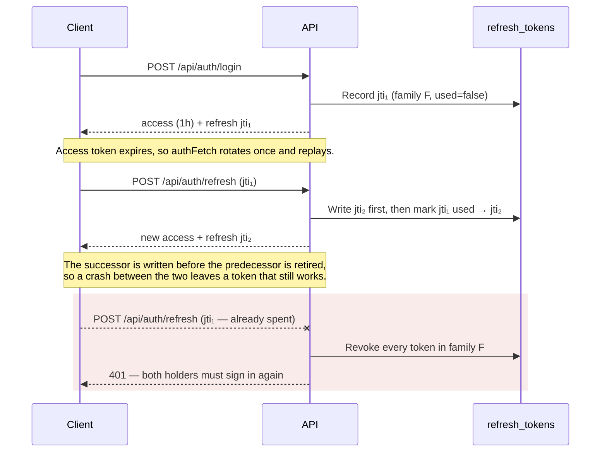
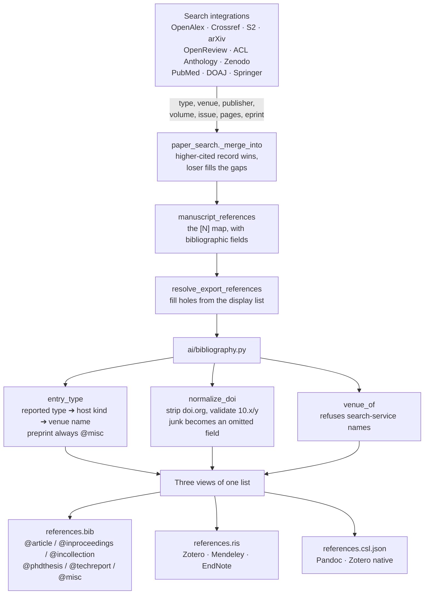
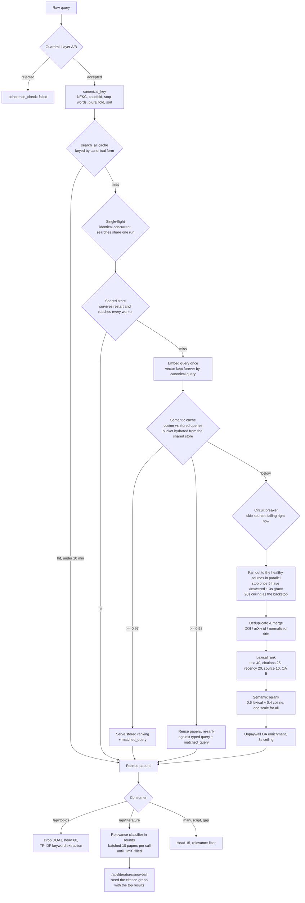
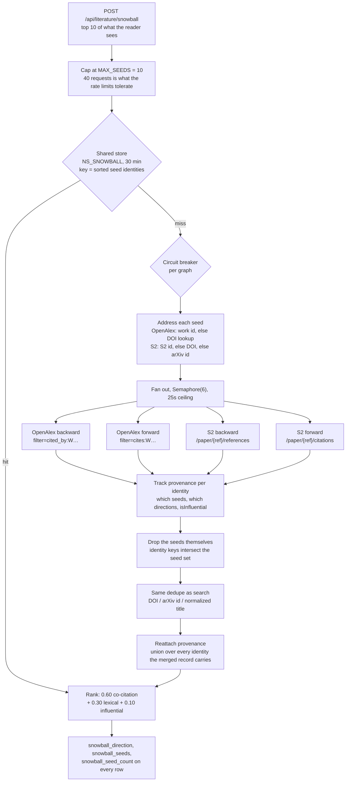
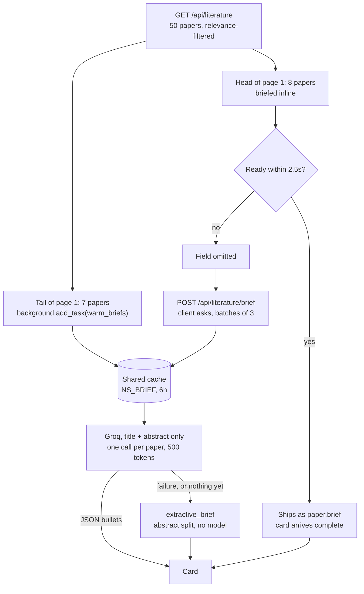
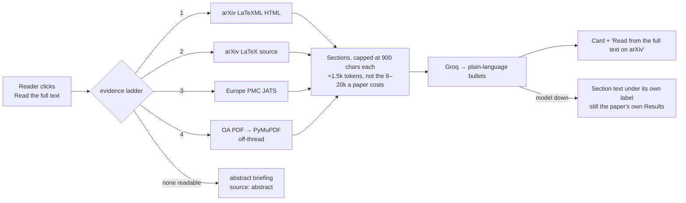
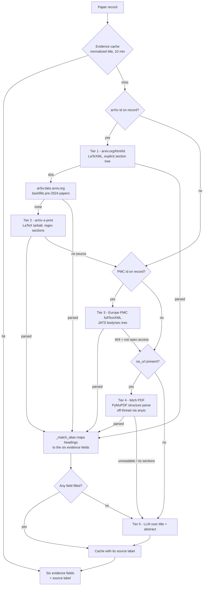
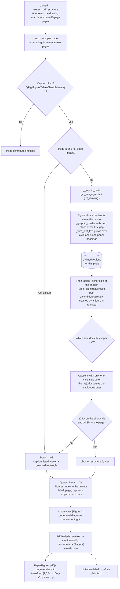
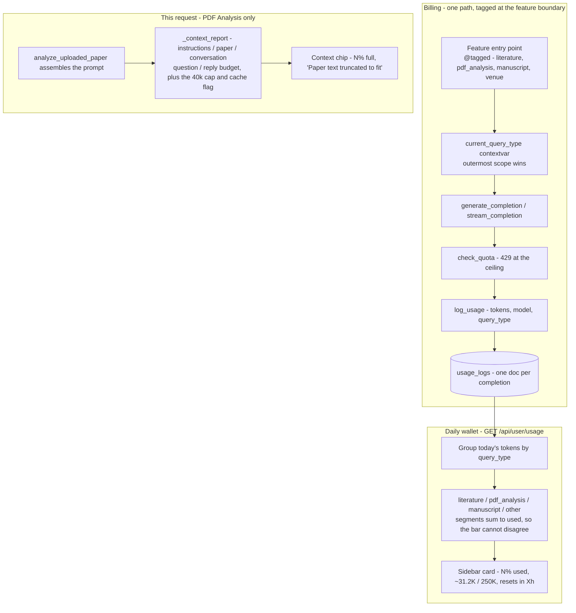

# System Architecture and Workflow

Here are the visual representations of how the Research Paper Guide system is structured and how data flows through it during a user's session.

## System Architecture

This diagram shows the major components: the React Frontend, the FastAPI Backend, the AI Engine with Multi-Provider Auto-Cascade, Knowledge Integrations, Database, and external AI services.


```mermaid
flowchart TD
    subgraph Frontend["Frontend - React + Vite"]
        UI["User interface + manuscript builder"]
        ApiClient["One API client - lib/api.js + query cache"]
        SSEr["SSE reader + typewriter state - ManuscriptBuilder"]
    end

    subgraph Backend["Backend API - FastAPI"]
        subgraph Edge["Middleware - outermost first"]
            CORS["CORS - trimmed origin allowlist"]
            BodyCap["Body size cap - 16MB, pre-buffer"]
            RateLimit["Rate limiter - default on every route"]
            Headers["Security headers + CSP"]
        end

        Router["API routes - routers/*.py"]
        Auth["Authentication + quotas - core/auth.py"]
        Wallet["Daily token wallet - services/usage_tracker.py<br/>quota, check_quota, log_usage tagged by feature"]
        Refresh["Refresh rotation + reuse detection - 1.14"]
        Verify["Email verification + reset - separate signing keys"]
        SSRF["SSRF guard - pinned IP, ports 80/443"]
        Consent["Third-party processing consent - 1.16"]

        subgraph SelfHeal["API self-heal"]
            Registry["Source registry - one fan-out list"]
            Health["Rolling health window + circuit breaker"]
            Retry["One retry policy - Retry-After + jitter"]
        end

        subgraph Caches["Cache tiers"]
            L1["In-process TTLCache + semantic cache"]
            L2["Shared store - Mongo, survives restart - 1.2"]
            Emb[("paper_embeddings - kept forever - 1.3")]
        end

        subgraph Research["Background research - 1.5"]
            Jobs["research_jobs - persisted stages"]
            Corpus["prepare_corpus - search, screen, evidence"]
        end

        subgraph AI_Engine["AI engine modules"]
            TD_AI["Topic discovery - TF-IDF, no LLM"]
            GA_AI["Gap analysis"]
            MG_AI["Manuscript generation + stream"]
            VR_AI["Venue recommendation + guideline alignment"]
            Rel["Relevance filter + backfill"]
            GR_AI["Citation grounding + numerical validator"]
            LLM_P["LLM provider - auto-cascade"]
            GemCache["Gemini prompt caching"]
            Embed["Embeddings - gemini-embedding-001"]
        end

        subgraph Integrations["Knowledge integrations - 12 sources, one pooled HTTP client"]
            Search["Unified search engine - search_all"]
            ArXiv["arXiv API"]
            OpenReview["OpenReview API"]
            ACLAnthology["ACL Anthology bibliography"]
            Zenodo["Zenodo API"]
            Crossref["Crossref API"]
            SemanticScholar["Semantic Scholar API"]
            OpenAlex["OpenAlex API - keyless, polite pool"]
            PubMed["PubMed / NCBI API"]
            EuropePMC["Europe PMC API"]
            Springer["Springer Nature API - key required"]
            DOAJ["DOAJ API"]
            GitHubKB["GitHub knowledge repos - on disk"]
            Unpaywall["Unpaywall - OA enrichment"]
        end

        subgraph Extraction["Document and evidence extraction"]
            Ladder["Evidence ladder - 5 tiers"]
            AxHTML["arXiv LaTeXML HTML / ar5iv"]
            AxTeX["arXiv LaTeX e-print"]
            PMCXML["Europe PMC fullTextXML - JATS"]
            PDFStruct["PyMuPDF structure parser - in-process"]
        end
    end

    subgraph Database["Storage"]
        MongoDB[("MongoDB")]
        S3[("AWS S3 - PDF bytes<br/>only when S3_BUCKET is set")]
    end

    subgraph External_LLM["External AI services - auto-cascade order"]
        OpenAI["OpenAI API"]
        Gemini["Google Gemini API - cached"]
        Groq["Groq API"]
        Cerebras["Cerebras API"]
        Mistral["Mistral API"]
        Kimi["Kimi / Moonshot API"]
        HF["HuggingFace API"]
        OpenRouter["OpenRouter API"]
        NVIDIA["NVIDIA NIM API"]
    end

    %% Frontend
    UI --> ApiClient
    ApiClient -->|"REST + SSE"| CORS
    ApiClient -->|"Byte stream, fetch reader"| SSEr
    SSEr -->|"Typewriter state"| UI

    %% Middleware chain, outermost first
    CORS --> BodyCap
    BodyCap --> RateLimit
    RateLimit --> Headers
    Headers --> Router

    %% Identity
    Router --> Auth
    Auth --> Verify
    Auth --> Refresh
    Refresh <-->|"Token families, reuse detection"| MongoDB
    Auth <-->|"Users + usage logs, 60s user cache"| MongoDB

    %% User-supplied bytes
    Router -->|"User-supplied URLs + OA PDFs"| SSRF
    Router -->|"PDF upload"| Consent
    SSRF -->|"Fetched bytes"| PDFStruct
    Consent -.->|"Only with explicit consent"| PDFStruct

    %% Routes into the AI engine
    Router --> TD_AI
    Router --> GA_AI
    Router --> MG_AI
    Router --> VR_AI
    Router --> Rel
    MG_AI -->|"SSE: status, sources_list, chunk, metadata, done"| Router

    %% AI engine internals
    TD_AI --> Search
    GA_AI --> Search
    GA_AI --> Rel
    GA_AI --> Ladder
    GA_AI --> LLM_P
    MG_AI --> Corpus
    MG_AI --> Rel
    MG_AI --> GR_AI
    MG_AI --> LLM_P
    VR_AI --> LLM_P
    Rel --> LLM_P
    GR_AI --> LLM_P
    LLM_P <-->|"Context caching over 32k tokens"| GemCache
    GemCache --> Gemini

    %% Provider cascade, in the order llm_provider tries them
    LLM_P -->|"1"| OpenAI
    LLM_P -->|"2"| Gemini
    LLM_P -->|"3"| Groq
    LLM_P -->|"4"| Cerebras
    LLM_P -->|"5"| Mistral
    LLM_P -->|"6"| Kimi
    LLM_P -->|"7"| HF
    LLM_P -.->|"Explicit selection only"| OpenRouter
    LLM_P -.->|"Explicit selection only"| NVIDIA

    %% Search fan-out
    Search --> SemanticScholar
    Search --> OpenAlex
    Search --> Crossref
    Search --> PubMed
    Search --> ArXiv
    Search --> OpenReview
    Search --> ACLAnthology
    Search --> Zenodo
    Search -->|"On disk, run in a thread"| GitHubKB
    Search --> Springer
    Search --> EuropePMC
    Search --> DOAJ
    Search -.->|"After dedupe"| Unpaywall

    %% Self-heal
    Search -->|"One fan-out list, per-source timeout"| Registry
    Search -->|"Skip a source whose circuit is open"| Health
    LLM_P -->|"Skip a provider whose circuit is open"| Health
    Health -.->|"Fed by every tracked call"| Search
    Health -.->|"Fed by every tracked call"| LLM_P
    SemanticScholar -->|"Retry only what a retry can fix"| Retry

    %% Caches
    Search <--> L1
    L1 -->|"Miss"| L2
    L2 <--> MongoDB
    Search -->|"Query + paper vectors"| Embed
    Embed --> Gemini
    Embed --> Emb
    Emb --> MongoDB

    %% Background research
    Router -->|"Topic known: warm the corpus"| Jobs
    Jobs --> Corpus
    Corpus --> Search
    Corpus --> Rel
    Corpus --> Ladder
    Corpus -->|"Prepared corpus"| L2
    Jobs <-->|"Persisted stages, replayed on reconnect"| MongoDB
    MG_AI -->|"Reads the prepared corpus"| L2

    %% Evidence ladder
    Ladder -->|"1. cheapest, explicit sections"| AxHTML
    Ladder -->|"2. LaTeX source"| AxTeX
    Ladder -->|"3. open-access biomedical"| PMCXML
    Ladder -->|"4. any PDF"| PDFStruct
    Ladder -.->|"5. last resort"| LLM_P

    %% Persistence
    Router <-->|"Save / load drafts, surveys, manuscripts"| MongoDB
    Router <-->|"Version history + restore - 1.10"| MongoDB
    Store["core/object_store.py - AWS-6"]
    Router <-->|"Upload / stream a PDF"| Store
    Store <-->|"S3_BUCKET set"| S3
    Store <-->|"otherwise GridFS"| MongoDB
```


> **Every arrow starts and ends at a real component.** Until Aug 2026 the search
> fan-out, the ladder and the cache edges were drawn from the *subgraph boxes*
> (`Integrations -.-> ArXiv`, `AI_Engine <--> GR_AI`) — a container pointing at
> something already inside it. Mermaid routes those back through the cluster
> border, so the boxes rendered as a hairball, and the nodes that do the actual
> work (`Search`, `TD_AI`, `GA_AI`, `VR_AI`, the SSE reader) sat unconnected
> beside it. The edges now name the module that makes the call.

> **The cascade order is the one** `llm_provider` **actually uses.** OpenAI first,
> then Gemini, Groq, Cerebras, Mistral, Kimi, HuggingFace — a provider joins the chain
> only when its key is set, so the effective order on a given deploy is that list
> minus whatever is unconfigured. OpenRouter and NVIDIA are reachable only by
> setting `LLM_PROVIDER` to them explicitly; they are never part of the auto
> chain, which is why they hang off a dashed edge.

> **A provider whose circuit is open is skipped.** Every provider call already
> went through `track_call`, which feeds `api_health.record(...)`, so the breaker
> had been watching the cascade all along and was simply never consulted — a
> revoked OpenAI key was re-tried, and re-failed, ahead of a working provider on
> every single request. `generate_completion` now asks it, exactly as
> `paper_search` does. Two details carry the design:
>
> - **`api_health.allow` is not side-effect free.** For an open breaker past its
> cooldown it *claims* the half-open probe, and a claim never followed by a
> recorded outcome would leave that provider blocked for good. So it is asked
> only about a provider already known to be blocked, and only immediately before
> that provider would be called — every claim is paired with a `track_call`.
> - **The gate stands down when nothing is healthy.** If every circuit is open,
> the cascade tries the full roster anyway. A global blip must not leave the app
> refusing to attempt anything: degrading to the old behaviour beats answering
> nothing, and the failure message names what was skipped so a shortened cascade
> is not mistaken for a total outage.
>
> **Each provider is given a request it can accept.** The prompt is built once,
> sized for the caller rather than for whichever provider ends up serving it, so
> a small-window provider used to answer `413 Payload Too Large` and be skipped
> over — on a day when it was the only one still alive. `_fit_to_provider` now
> trims to a per-provider ceiling (`_PROVIDER_INPUT_CHARS`, overridable with
> `LLM_INPUT_CHARS_<PROVIDER>`; zero switches trimming off).
>
> *What* it cuts is the point. The instructions sit at the top of the prompt and
> **the user's question sits at the bottom**, so a plain truncation would send a
> paper with no question attached. Only the text inside the `<document>` block
> is shortened; a prompt with no document block keeps both ends and loses its
> middle. Because the figure index leads the paper context, it survives the trim
> on every provider.
>
> Order is still fixed rather than health-ranked — the breaker decides who is
> *skipped*, not who goes first. One caveat: the request-context panel reports
> the cap the caller applied, so when a fallback provider trims further, the
> panel understates how much of the paper was actually dropped.

> **No hosted document-parsing service.** The evidence ladder replaced a hosted
> GROBID tier in Aug 2026: every free instance was down (the HF Space returns
> 503) and GROBID is a JVM service needing several GB, which does not fit the
> deploy target. Tiers 1–4 are keyless, and tier 4 runs in-process, so an
> uploaded PDF no longer depends on any third party.

> **PDF bytes have two homes, chosen by one variable (AWS-6).** With `S3_BUCKET`
> set, `core/object_store.py` writes uploads to S3; with it unset it writes to
> GridFS, which is the default and needs no AWS account. GridFS put the bytes in
> Mongo, where on Atlas M0 they compete for 512MB with the documents the app
> actually queries. Reads dispatch on the *shape* of the stored id — a 24-hex
> ObjectId is GridFS, anything else is an S3 key — so turning the bucket on does
> not strand a single file uploaded before it, and turning it off again still
> serves everything written while it was on. Ownership moved with the bytes: it
> used to live in GridFS `metadata.user_id`, and it is now the second segment of
> the key (`uploads/<user_id>/<uuid>.pdf`), which cannot be omitted the way
> metadata could. Deletes enumerate *versions*, not keys — the bucket is
> versioned, so a plain delete writes a marker and leaves the PDF behind.

> **Nothing clones on a request.** The GitHub knowledge repos are checked out
> into `backend/data/` by `python -m scripts.sync_github_repos` at build time.
> Until Aug 2026 `POST /api/github/sync` shelled out to `git clone` inside a
> request handler, so any signed-in user could hold a worker for minutes and
> write hundreds of megabytes of container disk on demand. That route is gone;
> the remaining `/api/github/*` routes only read what the deploy left on disk.

### Request-safety layers

Every request crosses four middleware layers before a route sees it, ordered so
that a rejection still carries CORS headers — a 429 or 413 without them reaches
the browser as an unexplained network failure rather than a reason.


| Layer            | Rejects                                                                          | Configured by                              |
| ---------------- | -------------------------------------------------------------------------------- | ------------------------------------------ |
| CORS             | Unknown origin                                                                   | `CORS_ORIGINS`                             |
| Body cap         | `Content-Length` over the ceiling, and a chunked body that exceeds it mid-stream | `MAX_REQUEST_BODY_BYTES` (16MB)            |
| Rate limit       | Over-budget caller, keyed on user id then client address                         | `DEFAULT_RATE_LIMIT`, `TRUSTED_PROXY_HOPS` |
| Security headers | — (adds CSP, HSTS, nosniff, frame-deny)                                          | `core/config.SECURITY_HEADERS`             |


`TRUSTED_PROXY_HOPS` **must** be set to the number of proxies in front of the
app (1 on Render). At the default of 0 the header is ignored and every
anonymous caller shares one bucket, because behind a proxy `request.client.host`
is the proxy for all of them. Reading the leftmost `X-Forwarded-For` entry
instead would be worse: that part of the chain is caller-supplied, so anyone
could mint a fresh bucket per request.

### Token classes

Three token classes, each with its own signing key, audience and `purpose`
claim. A reset link used to be signed with the session key and `purpose` was
never checked on decode, so pasting the token from a reset email into an
`Authorization` header was a full login.


| Token              | Key                                                               | Audience                        | Lifetime                          |
| ------------------ | ----------------------------------------------------------------- | ------------------------------- | --------------------------------- |
| Session (access)   | `JWT_SECRET_KEY`                                                  | `research-agent:access`         | 1h (`ACCESS_TOKEN_EXPIRE_HOURS`)  |
| Refresh            | `JWT_REFRESH_SECRET_KEY`, else derived                            | `research-agent:refresh`        | 14d (`REFRESH_TOKEN_EXPIRE_DAYS`) |
| Password reset     | `JWT_RESET_SECRET_KEY`, else derived by HMAC from the session key | `research-agent:password-reset` | 30 min                            |
| Email verification | `JWT_VERIFY_SECRET_KEY`, else derived                             | `research-agent:email-verify`   | 24h                               |


The derived keys mean no new environment variable is needed to deploy, while
each can still be pinned for independent rotation.

### Refresh rotation and reuse detection (1.14)

A 24-hour bearer token was a 24-hour window for anything that got hold of one:
nothing but an explicit logout could end it early. The session is now a short
access token plus a long **rotating** refresh token.


```mermaid
sequenceDiagram
    participant C as Client
    participant A as API
    participant DB as refresh_tokens

    C->>A: POST /api/auth/login
    A->>DB: Record jti₁ (family F, used=false)
    A-->>C: access (1h) + refresh jti₁

    Note over C,A: Access token expires, so authFetch rotates once and replays.
    C->>A: POST /api/auth/refresh (jti₁)
    A->>DB: Write jti₂ first, then mark jti₁ used → jti₂
    A-->>C: new access + refresh jti₂

    Note over C,A: The successor is written before the predecessor is retired,<br/>so a crash between the two leaves a token that still works.

    rect rgb(250, 235, 235)
        C--xA: POST /api/auth/refresh (jti₁ — already spent)
        A->>DB: Revoke every token in family F
        A-->>C: 401 — both holders must sign in again
    end
```


A spent refresh token being presented again means two parties hold it, and
there is no way to tell which one is asking. Revoking the family is the OAuth
2.0 BCP treatment and the whole reason rotation is worth having. Logout and
admin suspension revoke the family too — blacklisting the bearer token alone
would leave the refresh token minting new ones.

`get_current_user` reads the `users` document from a 60-second cache rather than
on every request; role changes, suspension and deletion invalidate it
explicitly, so a demotion takes effect immediately rather than a minute later.

## End-to-End User Workflow

This sequence diagram illustrates the step-by-step journey of a researcher using the platform, from finding a topic to generating grounded manuscript sections with auto-cascading AI fallbacks.


```mermaid
sequenceDiagram
    actor User
    participant Front as Frontend (React)
    participant API as Backend (FastAPI)
    participant DB as MongoDB
    participant Sources as Academic Search & Evidence Engine
    participant Cascade as Multi-Provider LLM Cascade
    participant Mail as Brevo (email)

    User->>Front: 0. Sign up
    Front->>API: POST /api/auth/signup
    API->>DB: Create account with email_verified=false
    API->>Mail: Verification link (24h, separate signing key)
    API-->>Front: "Check your email" — no session token
    Note over API,DB: The account cannot sign in yet. This is what stops<br/>someone registering with an address they do not own<br/>and inheriting the session when its real owner<br/>later signs in with Google.
    User->>Front: Click the emailed link
    Front->>API: POST /api/auth/verify-email
    API->>DB: email_verified=true, bump token version (single use)
    API-->>Front: Session token — signed in

    User->>Front: 1. Input interest / area
    Front->>API: GET /api/topics
    API->>API: Guardrail (Layer A/B) + canonical query key
    API->>Sources: Fan out to all sources (shared cache entry)
    Sources-->>API: Ranked, deduplicated papers
    API->>API: TF-IDF keyword extraction (no LLM)
    API-->>Front: Display topic directions (title + query)
  
    User->>Front: 2. Search Literature for Topic
    Front->>API: GET /api/literature
    API->>Sources: Reuse the same search_all cache entry
    Sources-->>API: Ranked, deduplicated papers
    API->>Cascade: Relevance classification, backfilled to `limit`
    Cascade-->>API: Relevant subset
    API-->>Front: Display papers & evidence
    User->>Front: 2b. Follow citations (optional)
    Front->>API: POST /api/literature/snowball (top 10 results as seeds)
    API->>Sources: OpenAlex + Semantic Scholar, references and citing works
    Sources-->>API: Expansion, deduplicated against the seeds
    Note over API,Sources: No relevance classification — a snowballed paper's abstract<br/>often shares no words with the query, which is exactly the<br/>prior work searching could not find. Its provenance<br/>("cited by 3 of your results") is the justification instead.
    API-->>Front: New papers, each badged with which seeds reached it
    User->>Front: Save relevant papers
    Front->>API: POST /api/literature/save
    API->>DB: Store saved survey
    User->>Front: Download PDF (live results or a saved survey)
    Front->>Front: jsPDF table, built in the browser — no API call
    Note over Front: Each row carries the paper link and the PDF /<br/>open-access link, printed as text and hyperlinked,<br/>so the export is usable away from the app.
  
    Note over Front,API: As soon as the topic settles, the corpus is built in the<br/>background (1.5) — so by the time Generate is pressed the<br/>fan-out, screening and full-text fetches are already done.
    Front->>API: POST /api/manuscript/research/prepare (topic)
    API->>DB: research_jobs — one run per topic, stages persisted
    API->>Sources: search ➔ screen ➔ evidence
    API->>DB: Prepared corpus into the shared cache (1h)
    API-->>Front: "Research ready"

    User->>Front: 3. Draft Manuscript Section (Streaming)
    Front->>API: POST /api/manuscript/stream (topic, section, mode="auto")
    alt Corpus already prepared
        API->>DB: Read the prepared corpus — no fan-out
    else Cold topic
        API->>Sources: Gather papers & extract evidence (Throttled Semaphore=3)
        API-->>Front: SSE Event: status (search ➔ screen ➔ evidence, live)
    end
    Note over Sources: Evidence ladder per paper:<br/>arXiv HTML ➔ arXiv LaTeX ➔ Europe PMC JATS<br/>➔ PyMuPDF PDF structure ➔ LLM on title+abstract
    Sources-->>API: Reference mapping & evidence context
    Note over API: Titles, abstracts, evidence, URLs and the user's own<br/>uploads go into the prompt inside sources tags, with any<br/>forged delimiter defused and a system rule saying the<br/>delimited regions are data, never instructions.
    API-->>Front: SSE Event: sources_list (emit references upfront)
  
    API->>Cascade: Stream completion (Gemini ➔ Groq ➔ Mistral ➔ OpenRouter ➔ OpenAI)
    alt Gemini Active (Context >32k)
        Cascade->>Cascade: Use/Create Gemini Cached Content
    end
  
    loop Real-Time Streaming & Seamless Continuation
        Cascade-->>Front: SSE Event: chunk (text delta)
        opt Mid-Stream Failure (e.g. 429 Rate Limit)
            Cascade-->>Front: SSE Event: provider_status ("Switching provider, resuming draft...")
            Cascade->>Cascade: Attach partial draft & continue seamlessly with next provider
        end
    end
  
    Cascade-->>API: Generation Complete
    API->>API: Sentence Grounding & Numerical Claim Validation
    API->>API: Citation index check — every [N] must name a real reference
    API-->>Front: SSE Event: metadata (citation flags, invalid citations, numerical checks, formatted refs)
    API-->>Front: SSE Event: done
  
    User->>Front: Edit & Save manuscript
    Front->>API: POST /api/manuscript/save
    API->>DB: Snapshot the state being replaced into manuscript_versions (1.10)
    API->>DB: Store manuscript draft
    opt Undo a bad save
        Front->>API: POST /api/manuscript/restore (version_id)
        API->>DB: Snapshot current, then write the version back
        API-->>Front: Restored draft — the restore is itself undoable
    end
  
    User->>Front: 4. Find Publication Venue & Check Guidelines
    Front->>API: POST /api/venues (send abstract)
    API->>Cascade: Recommend matching journals & align formatting checklist
    Cascade-->>API: Venues & alignment checklist
    API-->>Front: Display venue recommendations & guidelines

    User->>Front: 5. Export for submission
    Front->>API: POST /api/manuscript/export-latex (topic, venue)
    API->>DB: Read manuscript_references — the [N] map the writer was given
    API->>API: Resolve reference holes once, then render .tex + 3 bibliography formats
    API-->>Front: zip — paper.tex, references.bib / .ris / .csl.json, README
```


---

### The export bundle and its bibliography (2.8)

`/api/manuscript/export-latex` resolves the reference list **once**
(`resolve_export_references`) and hands that one list to every emitter, so the
three reference files cannot describe different sets. `ai/bibliography.py` is
the only module that decides what a reference *is*: its entry type, whether its
DOI is real, and which of its fields is the venue.

Two things it exists to prevent, both of which shipped before it:

* every entry exported as `@article`, whatever it actually was;
* the venue falling back to `paper["source"]` — the **search service** — so
  `.bib` files carried `journal = {OpenAlex}`.


```mermaid
flowchart TD
    Sources["Search integrations<br/>OpenAlex · Crossref · S2 · arXiv<br/>OpenReview · ACL Anthology · Zenodo<br/>PubMed · DOAJ · Springer"]
    Sources -->|"type, venue, publisher,<br/>volume, issue, pages, eprint"| Dedupe["paper_search._merge_into<br/>higher-cited record wins,<br/>loser fills the gaps"]
    Dedupe --> Snapshot["manuscript_references<br/>the [N] map, with bibliographic fields"]
    Snapshot --> Resolve["resolve_export_references<br/>fill holes from the display list"]

    Resolve --> Biblio["ai/bibliography.py"]
    Biblio --> ET["entry_type<br/>reported type ➔ host kind ➔ venue name<br/>preprint always @misc"]
    Biblio --> DOI["normalize_doi<br/>strip doi.org, validate 10.x/y<br/>junk becomes an omitted field"]
    Biblio --> VEN["venue_of<br/>refuses search-service names"]

    ET --> Emit
    DOI --> Emit
    VEN --> Emit
    Emit["Three views of one list"]
    Emit --> Bib["references.bib<br/>@article / @inproceedings / @incollection<br/>@phdthesis / @techreport / @misc"]
    Emit --> Ris["references.ris<br/>Zotero · Mendeley · EndNote"]
    Emit --> Csl["references.csl.json<br/>Pandoc · Zotero native"]
```

`paper.tex` cites with `\cite{}` keys generated by the same `bibtex_key` the
`.bib` uses, so the markers and the bibliography agree by construction rather
than by both happening to enumerate the same way.

---

## Search & Retrieval Pipeline

Every section that needs prior work — Research Discovery, Literature Survey,
manuscript generation, gap analysis — enters through the same pipeline. Only
the window size and what happens to the result differ.


```mermaid
flowchart TD
    Q[Raw query] --> G{Guardrail Layer A/B}
    G -->|rejected| X[coherence_check: failed]
    G -->|accepted| K[canonical_key<br/>NFKC, casefold, stop-words, plural fold, sort]
    K --> C{search_all cache<br/>keyed by canonical form}
    C -->|hit, under 10 min| R[Ranked papers]
    C -->|miss| SF{Single-flight<br/>identical concurrent searches share one run}
    SF --> SH{Shared store<br/>survives restart and reaches every worker}
    SH -->|hit| R
    SH -->|miss| E[Embed query once<br/>vector kept forever by canonical query]
    E --> SC{Semantic cache<br/>cosine vs stored queries<br/>bucket hydrated from the shared store}
    SC -->|>= 0.97| RV[Serve stored ranking<br/>+ matched_query]
    SC -->|>= 0.92| RR[Reuse papers, re-rank<br/>against typed query + matched_query]
    SC -->|below| CB{Circuit breaker<br/>skip sources failing right now}
    CB --> F[Fan out to the healthy sources in parallel<br/>stop once 5 have answered + 3s grace<br/>20s ceiling as the backstop]
    RV --> R
    RR --> R
    F --> D[Deduplicate & merge<br/>DOI / arXiv id / normalized title]
    D --> L[Lexical rank<br/>text 40, citations 25, recency 20, source 10, OA 5]
    L --> S[Semantic rerank<br/>0.6 lexical + 0.4 cosine, one scale for all]
    S --> OA[Unpaywall OA enrichment, 8s ceiling]
    OA --> R
    R --> U{Consumer}
    U -->|/api/topics| T[Drop DOAJ, head 60,<br/>TF-IDF keyword extraction]
    U -->|/api/literature| V[Relevance classifier in rounds<br/>batched 10 papers per call<br/>until `limit` filled]
    U -->|manuscript, gap| W[Head 15, relevance filter]
    V --> SB["/api/literature/snowball<br/>seed the citation graph<br/>with the top results"]
```


### Cache tiers

Three, and only the first is per-worker:


| Tier       | Where                                             | Holds                                                                                        | Lifetime                                                       |
| ---------- | ------------------------------------------------- | -------------------------------------------------------------------------------------------- | -------------------------------------------------------------- |
| L1         | `TTLCache` / `semantic_cache` in process          | Search results, semantic entries, relevance verdicts                                         | Minutes; dies with the worker                                  |
| L2         | `cache_entries` in Mongo (`core/shared_store.py`) | The same, plus citation expansions (`NS_SNOWBALL`), shared across workers and across deploys | 10 min (search), 30 min (snowball), to 6h (relevance verdicts) |
| Embeddings | `paper_embeddings` in Mongo                       | Vectors keyed by DOI → arXiv id → title, and by canonical query                              | **No expiry** — a paper's embedding does not go stale          |


L2 never raises and never blocks for long: on failure every call degrades to a
miss and the caller does the real work, and consecutive failures trip a breaker
so a broken store costs one timeout every few minutes rather than one per
lookup.

### Source roster

Twelve sources fan out in parallel. `integrations/registry.py` is the single list —
it is the fan-out order *and* the order per-database yield is reported in, so the
two cannot drift. Yield comes back on `SearchMeta.sources`, so a source that
timed out is distinguishable from one that returned nothing and from one that was
skipped because its circuit is open.


| Source                 | Key                         | Notes                                                       |
| ---------------------- | --------------------------- | ----------------------------------------------------------- |
| Semantic Scholar       | optional                    | Highest ranking weight                                      |
| OpenAlex               | **required since Feb 2026** | `OPENALEX_API_KEY`; ~$1/day free allowance                  |
| Crossref               | no (polite `mailto`)        | Also carries Retraction Watch data                          |
| PubMed / NCBI          | optional                    | 5s budget                                                   |
| arXiv                  | no                          | Also the LaTeX/HTML source for extraction                   |
| OpenReview             | no                          | Forum notes only (papers, not reviews). API v2, keyless     |
| ACL Anthology          | no                          | Full `anthology.bib.gz`, cached 24h. No per-query search API |
| Zenodo                 | no                          | Publications only (`/api/records`)                          |
| Europe PMC             | no                          | Also serves JATS full text                                  |
| Springer Nature        | yes                         |                                                             |
| DOAJ                   | no                          | Dropped for topic discovery — broad-OA noise skews keywords |
| GitHub Knowledge Repos | no                          | Local corpus, no network call                               |


Unpaywall runs *after* dedupe as OA enrichment, not as a search source.

**Two sources were removed rather than left to time out**, because each cost a
full per-source timeout and contributed zero papers:


| Removed | Why                                                                                                                                                    |
| ------- | ------------------------------------------------------------------------------------------------------------------------------------------------------ |
| BASE    | Returns `<error>Access denied for IP address …</error>` — it allow-lists registered egress IPs, which a PaaS dyno does not have and cannot keep stable |
| CORE    | Its own index returns HTTP 500: `not enough resources were available to cover 100% of the index`                                                       |


### Query identity

`core/query_key.py` is the single definition of "the same search".
`canonical()` reduces a query to a sorted set of stemmed content tokens, so
`"Machine Learning"`, `"machine learning"` and `"neural networks"` /
`"neural network"` resolve to one cache entry and one fan-out.

The canonical form is **cache identity only**. Outbound API calls, ranking and
everything the user sees use the original wording. `frontend/src/utils/searchHeuristics.js`
carries a byte-identical port so the client's in-flight dedupe guard and the
server cache agree; `ai/keyword_extractor.py` imports `GRAMMAR_STOPS` and
`stem` from the same module so tokenisation cannot drift.

### Semantic cache

Canonical keys collapse wording; they cannot collapse synonyms. `"CNN classification"` and `"convolutional neural network classification"` are one
search to a researcher and two full fan-outs to the canonical key.
`services/semantic_cache.py` closes that gap by keying on the query
*embedding* — which the rerank step needs anyway, so a true miss pays nothing
extra for the lookup.

Two tiers, both conservative:


| Cosine                         | Behaviour                                                                |
| ------------------------------ | ------------------------------------------------------------------------ |
| >= 0.97 (`VERBATIM_THRESHOLD`) | Serve the stored ranking untouched                                       |
| >= 0.92 (`RERANK_THRESHOLD`)   | Reuse the stored *papers*, re-rank them against the query actually typed |
| below                          | Miss — run the real search                                               |


The middle tier carries most of the value: re-ranking costs no network call
(paper embeddings are already cached by content digest) and guarantees the
ordering matches what the user asked for, so a near-miss degrades into a
slightly different candidate pool rather than answers to someone else's
question.

Entries are bucketed by fan-out parameters, so a `limit=5` search can never be
served from a `limit=50` entry, and the store is capped and TTL-pruned. A bucket
is hydrated from the shared store on the first miss after a restart and then
left alone for 60 seconds — the lookup is a similarity scan, so the whole bucket
has to be resident and a per-search query would cost more than it saves.

### Self-healing sources

`services/api_health.py` answers "is this failing **right now**", which the
lifetime counters in `api_telemetry` cannot: a source that answered a thousand
times this morning and has failed every call for ten minutes still reads as 99%
healthy there. Every tracked call feeds a rolling window; the decision is made
on the most recent 20 outcomes inside it, so a long history of success does not
delay noticing an outage.


|          |                                                                             |
| -------- | --------------------------------------------------------------------------- |
| Window   | 300s, most recent 20 calls judged                                           |
| Opens at | ≥ 5 calls and ≥ 60% failed                                                  |
| Cooldown | 60s, doubling to a 900s ceiling on each failed probe                        |
| Recovery | One half-open probe call; success closes it, failure re-opens it for longer |


An open circuit means the source is skipped for that search and reported as
`skipped` with the reason, rather than being called and costing the full
per-source timeout for nothing. `succeed(items=0)` counts as a failure here
exactly as it does for telemetry (API-6), so a source answering `200` with an
empty body forever is eventually skipped too.

`core/retry.py` is the one retry policy: retry only what a retry can fix (429,
5xx, timeouts, connection errors — never a 400/401/404), honour a numeric
`Retry-After`, otherwise back off with **full** jitter, and stop before the
caller's own deadline. Fixed sleeps were the previous behaviour, and they put
every concurrent retry in the same instant.

The fan-out no longer waits on stragglers either: once five sources have
answered, the rest get a three-second grace period and are then cancelled. The
20-second ceiling remains as the backstop rather than being what every search
actually costs — Semantic Scholar's tail latency used to set the wait for
everyone, and its papers are almost always duplicates the other sources already
returned.

**Disclosure is mandatory.** Every hit sets `matched_query` on the response and
the UI renders "Showing results for X — search instead for Y". The escape hatch
re-requests with `fresh=true`, which bypasses the semantic tier. A cached
answer to a question the user did not ask is only acceptable when the
substitution is visible and reversible.

Single-flight wraps the *entire* resolve path, embedding lookup included:
awaiting anything between the exact-cache check and in-flight registration lets
two concurrent identical searches both miss and both fan out.

Thresholds are measured, not guessed — `backend/scripts/eval_semantic_cache.py`
replays labelled query pairs and reports the false-hit rate across a threshold
sweep. Add a pair whenever a bad substitution is seen in the product; the list
is this cache's regression suite.

### Deduplication

A record is recognised by **any** of three identifiers: DOI, arXiv id, or full
normalized title. Matching records are *merged*, not discarded — the
higher-cited record wins field conflicts (it is usually the published version,
with better metadata) while the other fills in whatever the winner lacks
(usually the preprint's free `pdf_url`). Merging is transitive: a preprint
known only by arXiv id joins its published version through their shared title.

Records with no DOI, no arXiv id and no title are dropped — they cannot be
deduplicated, cited or opened.

**`abstract` is the one field taken by length rather than by citation count.**
Crossref and PubMed routinely return a one-line stub for a paper whose arXiv
record carries the full abstract, and the stub is usually the more-cited record
— so the rule above was discarding a complete abstract that had already been
fetched. Everything downstream (card briefings, relevance classification,
evidence extraction) reads only the merged record, so a stub there starves all
three. Placeholder wordings are named in `_PLACEHOLDERS` precisely so they
cannot win on length; PubMed's *"Abstract not available via PubMed summary
API."* is longer than many real abstracts.

### Ranking

Lexical scoring runs over every deduplicated paper. Semantic reranking then
embeds the query once and the top `RERANK_WINDOW` papers in one batched
request, and **every** paper is scored on the same `0.6·lexical + 0.4·semantic`
scale, with semantic = 0 where it is unknown. Mixing scales across the window
boundary previously let an unreranked paper outrank a better one purely
because it had never been embedded.

### Relevance filtering and backfill

`/api/literature` classifies papers in ranked order in rounds of
`limit + _BACKFILL_HEADROOM` until `limit` relevant papers are collected or the
corpus runs out. Cost stays proportional to what is returned rather than to the
corpus, and `limit` means what it says even when the ranked head is noisy.
`has_more` reports whether unexamined papers remain.

Papers are judged a page at a time: one prompt carries ten numbered papers and
the reply is one `<n>: yes|no` line each. That turns a 100-paper survey from
~34 serial round-trips through `Semaphore(3)` into 4, and it was the single
largest cost in the search path. A reply that cannot be aligned to the papers
is **rejected outright** and the page falls back to per-paper calls — slower,
but a partial parse would assign one paper's verdict to another.

Classifier failures fail **open** — the paper is included — and the failure is
cached briefly, so a rate-limited provider is not re-hammered once per paper on
every retry.

### Citation snowballing (2.2)

Keyword search finds papers whose *words* match the query. A survey is not
assembled that way: you find a few good papers, read what they cite, then read
what has cited them since. `POST /api/literature/snowball` is that second move —
`integrations/snowball.py` seeds from the reader's top results and walks the
citation graph in both directions.


```mermaid
flowchart TD
    SD["POST /api/literature/snowball<br/>top 10 of what the reader sees"] --> CAP[Cap at MAX_SEEDS = 10<br/>40 requests is what the rate limits tolerate]
    CAP --> CK{Shared store<br/>NS_SNOWBALL, 30 min<br/>key = sorted seed identities}
    CK -->|hit| RANK
    CK -->|miss| CB{Circuit breaker<br/>per graph}
    CB --> ID[Address each seed<br/>OpenAlex: work id, else DOI lookup<br/>S2: S2 id, else DOI, else arXiv id]
    ID --> FO["Fan out, Semaphore(6), 25s ceiling"]
    FO --> B1["OpenAlex backward<br/>filter=cited_by:W…"]
    FO --> F1["OpenAlex forward<br/>filter=cites:W…"]
    FO --> B2["S2 backward<br/>/paper/{ref}/references"]
    FO --> F2["S2 forward<br/>/paper/{ref}/citations"]
    B1 --> P[Track provenance per identity<br/>which seeds, which directions, isInfluential]
    F1 --> P
    B2 --> P
    F2 --> P
    P --> DR[Drop the seeds themselves<br/>identity keys intersect the seed set]
    DR --> DD[Same dedupe as search<br/>DOI / arXiv id / normalized title]
    DD --> RE[Reattach provenance<br/>union over every identity the merged record carries]
    RE --> RANK[Rank: 0.60 co-citation<br/>+ 0.30 lexical + 0.10 influential]
    RANK --> OUT["snowball_direction, snowball_seeds,<br/>snowball_seed_count on every row"]
```

**Why two graphs.** They disagree about a large share of any paper's edges — S2
parses reference lists out of PDFs, OpenAlex indexes publisher-deposited ones —
and each covers what the other cannot address. OpenAlex does not index arXiv's
DataCite DOI, so an arXiv-only seed resolves to nothing there; S2 answers the
same seed under `ARXIV:1706.03762`. OpenAlex has no usable title search to fall
back on (`filter=title.search:` answers HTTP 503, the failure that got CORE
removed as a source), so the second graph *is* the fallback.

**Why co-citation dominates the ranking.** A paper four of the reader's own
results cite is central to the area whether or not its title repeats the query.
It also has to carry the forward direction, where the graphs are uneven: OpenAlex
sorts citing works by citation count, S2's `/citations` takes no sort parameter
and returns an arbitrary page, which for a heavily cited seed is mostly last
month's passing references.

**Why the relevance classifier is skipped.** Unlike `/api/literature`, an
expansion is not filtered by the LLM. A snowballed paper's abstract often shares
no vocabulary with the query — that is precisely the prior work the reader could
not have found by searching — so classifying it would throw away the result. The
provenance on each row is the justification instead, and the card states it
(`Cited by 3 results`).

**Why empty is not a failure.** A paper with no indexed references is ordinary,
and a snowball issues up to 40 of these requests. The telemetry helper counts
`succeed(items=0)` as unhealthy — right for a keyword search, wrong here — so
both fetchers record an empty traversal through `_record_empty`, which reports
success without an item count. Otherwise one snowball over unindexed seeds would
open the breaker on a healthy graph and take keyword search down with it.

### Card briefing

A survey card carries **title and abstract only** — the evidence ladder that
reads full text runs at manuscript time and is far too expensive per card. So a
briefing is a re-presentation of the abstract, never a summary of a section the
pipeline has not read, and the card says so in its footnote.


```mermaid
flowchart TD
    S["GET /api/literature<br/>50 papers, relevance-filtered"] --> H[Head of page 1: 8 papers<br/>briefed inline]
    H --> D{Ready within 2.5s?}
    D -->|yes| R["Ships as paper.brief<br/>card arrives complete"]
    D -->|no| M[Field omitted]
    S --> T["Tail of page 1: 7 papers<br/>background.add_task(warm_briefs)"]
    T --> K[(Shared cache<br/>NS_BRIEF, 6h)]
    M --> B["POST /api/literature/brief<br/>client asks, batches of 3"]
    B --> K
    K --> G[Groq, title + abstract only<br/>one call per paper, 500 tokens]
    G -->|JSON bullets| C[Card]
    G -->|failure, or nothing yet| E[extractive_brief<br/>abstract split, no model]
    E --> C
    R --> C
```

**Why the work is split three ways.** All LLM calls share `global_llm_sem`,
which is **3 wide** — the same gate relevance classification and manuscript
generation queue on. Briefing all 50 returned papers inline would be ~17 waves,
adding 15–25s to every search while starving the rest of the app. So the head
of the first page is briefed under a **2.5s deadline** (whatever is ready ships,
the rest is simply absent — a partial result is never sent), the tail of that
page is warmed *after* the response through `BackgroundTasks`, and anything past
page 1 is briefed on demand exactly as before.

Bullets live in two tiers: the per-process dict (10 min) and `NS_BRIEF` in the
shared store (**6h**, like relevance verdicts). **Only model output is stored** —
caching the extractive fallback would freeze a degraded briefing in place for
hours. The durable tier is what makes the warm pass pay: by the time the reader
scrolls, the client's POST is a cache hit, and a repeat query — from any worker,
for any user — costs nothing and yields the *same* bullets instead of re-rolling
them.

`_attach_briefs` copies each paper before adding `brief`. The dicts it is handed
are the cached search results; writing into them would serve one query's
briefings as part of the next query's cache hit.

#### Reading the full text — `POST /api/literature/deep-brief`

Everything above works from the abstract. When the abstract genuinely never
states an outcome, the only fix is the paper itself — but that is **one card,
on demand**, never a page:


```mermaid
flowchart LR
    R["Reader clicks<br/>Read the full text"] --> L{evidence ladder}
    L -->|1| A[arXiv LaTeXML HTML]
    L -->|2| X[arXiv LaTeX source]
    L -->|3| P[Europe PMC JATS]
    L -->|4| F["OA PDF → PyMuPDF<br/>off-thread"]
    L -->|none readable| AB["abstract briefing<br/>source: abstract"]
    A & X & P & F --> S["Sections, capped at 900 chars each<br/>≈1.5k tokens, not the 8–20k a paper costs"]
    S --> G[Groq → plain-language bullets]
    G --> C["Card + 'Read from the full text on arXiv'"]
    G -->|model down| SL["Section text under its own label<br/>still the paper's own Results"]
```

The ladder is `extract_evidence_for_paper` in `ai/evidence_extraction.py` — the
same one manuscript generation uses, reused rather than reimplemented. Its
ordering *is* the efficiency argument: arXiv HTML and PMC JATS are structured
text and keyless, so a PDF is downloaded only when nothing else answers.

Per-paper cost, measured against the abstract path:

| Path | Bytes moved | Latency | LLM input |
| --- | --- | --- | --- |
| Abstract briefing | ~2 KB | 0.6–1.5s | ~250 tok |
| Full-text briefing | 0.2–10 MB | 1–8s fetch + up to 3s parse | ~1.5k tok |

Which is why it is bound to a click, rate-limited to **10/minute**, and cached
under a `deep:` key in `NS_BRIEF` for 6h. **Only the bullets are stored** —
about 500 bytes. The PDF is dropped after parsing and the extracted text is
never cached: a parsed paper is 50–150 KB, and 50 of those per search is the
kind of thing that moved uploaded PDFs off Mongo in the first place (AWS-6).

Three outcomes reach the card, and it says which: bullets from the full text
(`source: arxiv-html`, `europepmc-fulltext`, …), the section text labelled
as-is when the model is down, or the abstract briefing with `source: abstract`
when nothing was readable — which is most closed-access papers, and the card
then stops offering the button rather than leaving a control that can only
fail.

Both halves — `backend/ai/paper_brief.py` and the mirror in
`frontend/src/pages/LiteratureSurvey.jsx` — share three rules, and the pair is
kept byte-identical on the same input:

- **A bullet ends on a sentence boundary.** Text under 180 characters is left
  alone; past that we keep the longest run of whole sentences fitting in 260, so
  a 200-character sentence survives intact. Only a sentence longer than 260 is
  cut, and then it ends in `…`. Cutting at 180 and appending a full stop — what
  it did before — turned *"…evaluated using multiple datasets and metrics"* into
  the finished-looking claim *"…evaluated using multiple."*
- **`Results` needs a stated outcome**: a number, or a comparative verb
  (`outperform`, `improv`, `reduc`…) owned by the work. A sentence that only
  describes the evaluation setup — *"we evaluate on three datasets"* — is
  `Method`, and background prose carrying an outcome word (*"increasingly
  used"*) is neither. `Results` is never filled from leftovers; an abstract that
  reports no outcome simply gets no `Results` bullet.
- **A truncated abstract is marked, not dressed up.** Source APIs often return
  an abstract that stops mid-sentence; the final clause then ends in `…`. Clause
  splits at `We` / `Our` are repaired first — dangling `and`/`which` dropped,
  first letter capitalised — so a fragment reads as a sentence.

### Caches


| Cache                    | Key                                    | TTL                                       | Scope                |
| ------------------------ | -------------------------------------- | ----------------------------------------- | -------------------- |
| `search_all` results     | canonical query + fan-out params       | 10 min                                    | process **+ shared** |
| In-flight searches       | same key                               | request                                   | process              |
| Paper embeddings         | paper identity: DOI → arXiv id → title | 10 min in process, **never** in the store | process **+ shared** |
| Query embeddings         | canonical query                        | 10 min in process, **never** in the store | process **+ shared** |
| Semantic query results   | query embedding, cosine-matched        | 10 min                                    | process **+ shared** |
| Relevance verdicts       | canonical topic + paper identity       | 10 min in process, 6h shared              | process **+ shared** |
| Card briefings           | paper identity (no query in the key)   | 10 min in process, 6h shared              | process **+ shared** |
| Suggestion history       | lowercase query                        | 7 days                                    | process **+ shared** |
| Prepared research corpus | canonical topic                        | 1 hour                                    | process **+ shared** |
| Classifier failures      | same key                               | 1 min                                     | process              |
| Extracted evidence       | `core.paper_identity`                  | 10 min                                    | process              |
| arXiv category feed      | category + limit                       | 15 min                                    | process              |
| Cached user document     | user id                                | 60s, invalidated on role/status/delete    | process              |
| Gemini context cache     | prompt cache key                       | 30 min                                    | provider             |


Every cache is a `core.ttl_cache.TTLCache`: expiry on read *and* an LRU
capacity ceiling. They were plain dicts that grew for the lifetime of the
process — an entry nobody looked up again was never released, and paper
embeddings are 3072 floats each.

The TTLs above are *retention* ceilings. Where a shorter freshness rule
applies it is enforced at the call site and remains authoritative — search
results are deliberately readable past their 10-minute freshness window so a
total source outage can fall back to a stale entry rather than return nothing.

Anything marked **shared** falls through to `core/shared_store.py` on an
in-process miss, so a redeploy or a second worker no longer starts cold. Mongo
rather than Redis: the deployment already has one, a TTL index does the
eviction, and nothing new has to be provisioned. The backend is one file's worth
of private functions, which is where a Redis implementation would drop in.

### HTTP connection pooling

Every integration used to construct its own `httpx.AsyncClient` per call, so a
single search paid one TCP handshake and one TLS negotiation per source. They
now share one pooled client (`integrations/http_client.py`) with keep-alive,
closed on app shutdown via the lifespan. The LLM providers
(`ai/llm_provider.py`) and the admin health probes (`services/admin_status.py`)
are on the same pool — they hit the same handful of hosts on every generation
and every status refresh, which is exactly the case keep-alive exists for.

A client created on a different event loop is discarded rather than reused: the
app runs one loop, but a management script calling `asyncio.run`, or
`uvicorn --reload` between reloads, would otherwise inherit a pool whose sockets
are already gone.

Per-source settings that used to live on the client — User-Agent, timeout —
are per-*source*, not per-connection, so `pooled_client(headers=..., timeout=...)`
applies them as per-request defaults instead. That keeps each source's latency
budget (PubMed 5s, arXiv 15s) while they all share one pool.

### Rate limits and guardrails

Every route has a budget. `DEFAULT_RATE_LIMIT` (120/minute) is applied by
`SlowAPIMiddleware` to anything that has not declared its own `@limiter.limit`,
so a new endpoint is throttled the moment it is added rather than whenever
somebody remembers to decorate it. Routes that cost more than a database read —
LLM calls, source fan-outs, the GitHub corpus walk, the admin probe — declare a
tighter budget, and slowapi skips the default for those.

`/api/topics` and `/api/literature` trigger the same fan-out and both carry
`5/minute` — throttling only one let the other keep burning source quota after
the limit tripped. Layer A/B validation runs on `/api/topics`,
`/api/literature`, `/api/arxiv/search` and `/api/github/search`; a rejected
query returns `coherence_check: "failed"` and never reaches a source.

Layer A scores each word token separately rather than the whitespace-stripped
query — concatenating words invented consonant runs across word boundaries
(`"CNN classification"` → `"CNNcl"`) and rejected ordinary acronym queries as
keyboard mash.

---

## Document & Evidence Extraction

Turning a paper into the six evidence fields (`objective`, `method`, `dataset`,
`results`, `limitations`, `future_work`) is a ladder, not a single parser. Each
rung is tried only when the one above it has nothing to give, so the common case
never downloads a PDF and the LLM is a last resort rather than the default.


```mermaid
flowchart TD
    P[Paper record] --> C{Evidence cache<br/>normalized title, 10 min}
    C -->|hit| DONE[Six evidence fields<br/>+ source label]

    C -->|miss| AX{arXiv id on record?}
    AX -->|yes| H[Tier 1 - arxiv.org/html/id<br/>LaTeXML, explicit section tree]
    H -->|404| A5[ar5iv.labs.arxiv.org<br/>backfills pre-2024 papers]
    A5 -->|none| TEX[Tier 2 - arXiv e-print<br/>LaTeX tarball, regex sections]
    H -->|parsed| MAP
    A5 -->|parsed| MAP
    TEX -->|parsed| MAP

    AX -->|no| PM{PMC id on record?}
    TEX -->|no source| PM
    PM -->|yes| JATS[Tier 3 - Europe PMC fullTextXML<br/>JATS body/sec tree]
    JATS -->|parsed| MAP
    JATS -->|404 = not open access| OA

    PM -->|no| OA{oa_url present?}
    OA -->|yes| PDF[Tier 4 - fetch PDF<br/>PyMuPDF structure parse<br/>off-thread via anyio]
    PDF -->|parsed| MAP
    PDF -->|unreadable / no sections| LLM
    OA -->|no| LLM[Tier 5 - LLM over title + abstract]

    MAP[_match_alias maps headings<br/>to the six evidence fields] --> Q{Any field filled?}
    Q -->|yes| STORE[Cache with its source label]
    Q -->|no| LLM
    LLM --> STORE
    STORE --> DONE
```


The `source` label returned alongside the evidence (`arxiv-html`,
`arxiv-latex`, `europepmc-fulltext`, `pdf-structure`, `llm-fallback`, `none`) is
what makes the tier visible in logs and in the admin view — a corpus silently
answered entirely from tier 5 looks identical to a well-grounded one otherwise.

### Why the ladder is ordered this way

Cost and fidelity move together here, which is unusual and worth stating: the
cheapest rungs are also the most accurate.


| Tier            | Network         | Structure quality                             |
| --------------- | --------------- | --------------------------------------------- |
| arXiv HTML      | one GET         | Explicit `<section>` tree — nothing inferred  |
| arXiv LaTeX     | one GET + untar | Sections from `\section{}`, macros unresolved |
| Europe PMC JATS | one GET         | Explicit `<body><sec><title>` tree            |
| PDF structure   | GET + parse     | Headings *inferred* from font size and layout |
| LLM             | provider call   | Title + abstract only; no full text at all    |


### PDF structure parsing

`ai/pdf_structure.py` is the only tier that has to guess. It reads PyMuPDF's
span dictionary, takes the modal font size as the body size, and treats short
larger-or-bold lines as headings. Three corrections make that usable rather than
merely plausible:

- **Rotated spans are dropped.** The arXiv sidebar stamp is the largest text on
page 1 and would otherwise be selected as the title.
- **Running headers are removed** by tallying blocks whose *digit-stripped* text
recurs on three or more pages. Matching on exact text fails because the header
carries the page number, which is why one paper previously reported 111
"sections".
- **Numbering is stripped and subsections folded into their parent**, so
`3.1 Encoder and Decoder Stacks` joins `method` instead of becoming a
top-level key no alias could ever match.

Authors are recovered from the blocks between the title and the abstract
heading, cut at the first affiliation or email token, then split greedily (two
capitalised tokens, or three when the middle one is an initial). This is
best-effort: it is correct on ordinary `First Last` and `First M. Last` lists,
and truncates three-token given names.

Measured on four papers with distinct layouts:


| Paper                     | Sections | Authors |
| ------------------------- | -------- | ------- |
| Attention Is All You Need | 9        | 8 / 8   |
| GPT-3                     | 20       | 15 / 15 |
| BERT                      | 11       | 4 / 4   |
| CLIP (two-column)         | 30       | 11 / 12 |


### Figure grounding — the paper's own figures in the chat (RP-12)

The same layout pass that finds headings also builds a **figure inventory**, so
PDF analysis can answer with the paper's real figures instead of a diagram the
model invented. `extract_figures` emits one record per caption onto
`structure["figures"]`:

```
{label: "Figure 3", kind: "figure"|"table", caption, page,
 bbox: [x0, y0, x1, y1] | null, page_size: {width, height}}
```

**No pixels are ever shipped, stored or fetched.** The browser already holds the
PDF in pdf.js for Read mode, so a figure is a clip of a page it has parsed
already — the backend sends a few hundred bytes of coordinates on the
`structure` object that upload, `pdf_chats` and reload already carry. There is
no image endpoint, no `object_store` write, and no vision call anywhere on this
path, which is also why it needs no consent gate.


```mermaid
flowchart TD
    U["Upload → extract_pdf_structure<br/>off-thread: the drawing scan is ~4s on a 48-page paper"] --> T["_text_rects per page<br/>+ _running_furniture across pages"]
    T --> C{"Caption block?<br/>^(Fig|Figure|Table|Chart|Scheme) N"}
    C -->|no| SKIP[Page contributes nothing]
    C -->|yes| SCAN{"Page is one full-page image?"}
    SCAN -->|yes, a scan| NOBOX["bbox = null<br/>caption listed, never a guessed rectangle"]
    SCAN -->|no| G["_graphic_rects<br/>get_image_rects + get_drawings"]

    G --> FIG["Figures first - content is above the caption<br/>_graphic_cluster walks up, stops at the first gap<br/>_with_plot_text grows over axis labels and panel headings"]
    FIG --> CLAIM[(claimed regions<br/>for this page)]
    CLAIM --> TAB["Then tables - either side of the caption<br/>_table_candidates costs both<br/>a candidate already claimed by a figure is rejected"]
    TAB --> VOTE{"Which side does this paper use?"}
    VOTE --> OUT["Captions with only one valid side vote;<br/>the majority settles the ambiguous ones"]
    OUT --> SIZE{"≥24pt on the short side<br/>and ≥0.8% of the page?"}
    SIZE -->|no| NOBOX
    SIZE -->|yes| BOX["bbox on structure.figures"]

    BOX --> PROMPT["_figures_block → '## Figures' index in the prompt<br/>label, page, caption - capped at 4k chars"]
    NOBOX --> PROMPT
    PROMPT --> MODEL["Model cites [Figure 3]<br/>generated diagrams banned outright"]
    MODEL --> FE["PdfAnalysis rewrites the citation to #fig-<label><br/>the same trick [Page N] already uses"]
    FE --> RENDER["PaperFigure: pdf.js page.render with<br/>transform [1,0,0,1,-x0·s,-y0·s] = a crop"]
    FE --> PLAIN["Unknown label → left as plain text"]
```

**Why `get_drawings()` is the load-bearing half.** matplotlib and TikZ plots are
vector operators, not embedded bitmaps. ResNet contains **0 raster images and
1364 drawings**, and every figure in it is a real plot — `get_images()` alone
finds the journal logo and nothing else.

Three rules do the actual discriminating, and each replaced an obvious one that
failed on a real paper:

- **Prose is measured in words per line, not words.** A figure band runs from
its caption up to the preceding *paragraph*, but every tick label and legend
entry inside a plot is its own text block. A 12-word floor called a CLIP axis
block prose and collapsed the band to nothing; body text sets ~10 words to the
line and plot furniture 1–2, which separates them cleanly.
- **The column gutter is read off the page, not assumed to be the midline.** In
a two-column paper the right column starts about three points past centre, so a
midline split pulled the *other* column's paragraphs in as neighbours.
- **A caption belongs to the content it is adjacent to, and figures claim
first.** ResNet's "Table 1." sits 3pt below its own table and 3pt above Figure
4's plot; BERT prints every table caption *below* its table while Transformer
prints them above. Proximity alone decided BERT's page 7 by 0.1pt and assigned
every table to its neighbour's caption — so unambiguous captions vote on the
document's convention and the majority settles the rest.

**`bbox: null` is a first-class answer**, not a failure: a scan, a pseudocode
listing, or a cross-reference like "Figure 8 shows…" is listed by caption and
rendered caption-only with a page link. A wrong crop is worse than no crop,
because the reader trusts what it is shown.

Measured against real arXiv PDFs — **81 of 85 captions** resolved to a box
(ResNet 21/21, Transformer 9/9, BERT 13/13, CLIP 38/42; the CLIP misses are a
pseudocode listing, a full-page image grid and two oversized appendix tables).
PyMuPDF's coordinates and pdf.js's viewport were checked against each other on
46 text spans across six pages: **worst disagreement 0.01pt**, which is what
makes the crop transform a pure translation.

### Heading vocabulary

`SECTION_ALIASES` in `ai/pdf_extraction.py` maps headings onto the six evidence
fields, and `_match_alias` strips a leading number before matching so
`2 Background`, `II. Background` and `Background` are one heading across all
four tiers. The table has to cover discipline-specific naming: ML papers label
their methods section *Model Architecture* or *Approach* rather than *Methods*,
and until those aliases existed the Transformer paper mapped no `method`
evidence at all despite parsing perfectly.
---

## What a Request Costs — the two meters

There are two meters and they measure different things. Confusing them is how
the old sidebar ended up telling people they had "50 messages left" for a
product where one PDF analysis can cost four of those and one literature brief
a fraction of one.

| | Daily AI wallet | This request |
|---|---|---|
| Where | Sidebar, every page | PDF Analysis, beside the composer |
| Unit | Real provider tokens | Estimated tokens (`chars / 4`) |
| Denominator | `users.custom_quota` or 250,000 | The paper's char cap + the rest of this prompt + the reply budget |
| Word | **used** | **full** |
| Resets | Midnight UTC | Every message |
| Source | `usage_logs` summed for today | `analyze_uploaded_paper` reporting the prompt it just built |


```mermaid
flowchart TD
    subgraph Spend["Billing - one path, tagged at the feature boundary"]
        Entry["Feature entry point<br/>@tagged - literature, pdf_analysis, manuscript, venue"]
        Ctx["current_query_type contextvar<br/>outermost scope wins"]
        Gen["generate_completion / stream_completion"]
        Check["check_quota - 429 at the ceiling"]
        Log["log_usage - tokens, model, query_type"]
        Logs[("usage_logs - one doc per completion")]
        Entry --> Ctx --> Gen --> Check --> Log --> Logs
    end

    subgraph Wallet["Daily wallet - GET /api/user/usage"]
        Group["Group today's tokens by query_type"]
        Buckets["literature / pdf_analysis / manuscript / other<br/>segments sum to used, so the bar cannot disagree"]
        Card["Sidebar card - N% used, ~31.2K / 250K, resets in Xh"]
        Logs --> Group --> Buckets --> Card
    end

    subgraph Window["This request - PDF Analysis only"]
        Build["analyze_uploaded_paper assembles the prompt"]
        Report["_context_report - instructions / paper / conversation<br/>question / reply budget, plus the 40k cap and cache flag"]
        Chip["Context chip - N% full, 'Paper text truncated to fit'"]
        Build --> Report --> Chip
    end
```

**Why the tag is a contextvar and not an argument.** Only four call sites in
`ai/llm_provider.py` ever bill, and they sit many layers below the feature that
asked. Threading a tag down would touch every signature in between. The
boundary sets it once; everything underneath inherits it, including a search
that fans out into fifty briefings, a background `warm_briefs` that outlives
the response, and a manuscript section still streaming after the endpoint
returned.

**Outermost wins.** Evidence extraction runs under the literature survey *and*
under manuscript generation. The spend belongs to whoever asked, so an inner
scope never overwrites an outer one — it only fills in the `general` default.

**`venue` has no bucket of its own.** It is a real tag, and the wallet folds it
into `other` along with anything untagged. Unknown tags are bucketed rather
than dropped, so the four segments always add up to `used`.

**Estimates are labelled.** The wallet is exact — it sums what the providers
reported. The request panel divides characters by four and says so, and prefixes
its numbers with `~`. Cached paper text is marked `cached`: it still occupies
the window, it is only the billing that changes, so it stays in the bar.
