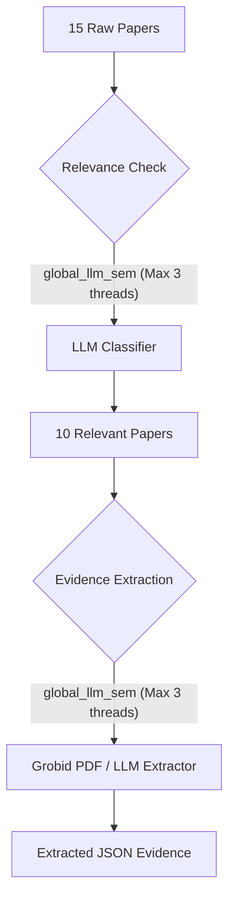
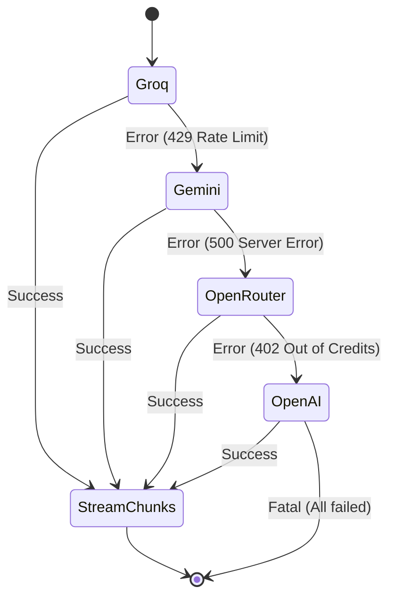

# Manuscript Generation Workflow

This document details the complete technical architecture and data pipeline behind the **Manuscript Generation** system in the AI-Powered Research Agent. It outlines exactly what happens the moment a user clicks "Generate" on the frontend.

## High-Level Architecture Flow

```mermaid
sequenceDiagram
    participant UI as React Frontend
    participant API as FastAPI (main.py)
    participant Prep as _prepare_generation
    participant Search as Academic APIs
    participant Filter as Relevance & Evidence
    participant Cascade as stream_completion_auto
    participant LLM as External AI Providers
  
    UI->>API: POST /api/manuscript/stream (topic, mode="auto")
    API->>Prep: Start Preparation
  
    rect rgb(20, 30, 50)
        Note right of Prep: 1. Data Aggregation Phase
        Prep->>Search: search_all(topic)
        Search-->>Prep: Raw Paper Metadata
      
        Prep->>Filter: _filter_relevant_papers()
        Note over Filter: Throttled to 3 concurrent calls
        Filter-->>Prep: Relevant Papers
      
        Prep->>Filter: extract_evidence_for_paper()
        Note over Filter: Throttled to 3 concurrent calls
        Filter-->>Prep: Extracted Evidence JSON
    end
  
    Prep->>Prep: Synthesize Evidence into Context Block
    Prep-->>API: (user_prompt, system_prompt, context)
  
    rect rgb(30, 50, 30)
        Note right of API: 2. Auto-Cascade Generation Phase
        API->>Cascade: Begin Cascade (Groq ➔ Gemini ➔ OpenRouter ➔ OpenAI)
      
        loop Fallback Chain
            Cascade->>UI: yield {type: "provider_active"}
            Cascade->>LLM: Stream prompt
            alt Success
                LLM-->>Cascade: Stream Chunks
                Cascade->>UI: yield {type: "chunk", text: "..."}
            else HTTP 429 / 402 Error
                LLM-->>Cascade: Exception Thrown
                Cascade->>UI: yield {type: "provider_switch"}
                Note right of Cascade: Move to next provider in chain
            end
        end
    end
    Cascade->>UI: yield {type: "done"}
```

---

## 1. Request Handling (`main.py`)

When the frontend sends a request to `/api/manuscript/stream`, it reaches the `draft_manuscript_stream` endpoint.

- **Rate Limiting**: It enforces a strict endpoint limit (15 requests per minute) to prevent abuse.
- **Context Allocation**: It attaches the requested provider/model into `ContextVar` memory bins for accurate backend usage tracking.
- **Routing**: It fires off the asynchronous generator `generate_section_stream` and wraps the output in a Server-Sent Events (SSE) `StreamingResponse`.

---

## 2. Preparation & Research Phase (`_prepare_generation`)

Before an LLM generates a single word, the backend must arm it with academic context. This happens in `_prepare_generation` inside `ai/manuscript_generation.py`.

### A. Literature Gathering

- The app queries scholarly databases (Semantic Scholar, Crossref, OpenAlex) via `search_all` to fetch the top ~15 papers related to the topic.

### B. Concurrent Processing Pipeline

Because processing 15 papers simultaneously would shatter AI rate limits (especially Groq's Token-Per-Minute limit), this phase uses strict **asyncio concurrency throttles**.

- **Relevance Check**: Every paper is run through `_filter_relevant_papers`. If the paper lacks a native relevance score, a small, fast LLM classifies it ("yes/no").
- **Evidence Extraction**: The relevant papers are passed to `extract_evidence_for_paper`. This attempts to extract `"objective", "method", "dataset", "results"` from PDF bytes using Grobid. If a PDF is unavailable, it falls back to an LLM extraction prompt.

### C. Context Synthesis & Prompt Assembly

- The system weaves the extracted evidence into a massive string array (the `context`).
- If the user is generating a **Literature Review**, it triggers an additional `analyze_gaps()` pass to find consensus, conflicts, and gaps between the papers.
- Finally, the context is forcibly attached to the bottom of the `user_prompt`.

---

## 3. The Auto-Cascade Loop (`stream_completion_auto`)

Now that the prompt is fully weaponized with research data, the backend begins generation in `ai/llm_provider.py`.

1. **Activation**: The backend iterates over a strict hardcoded list: `("groq", "gemini", "openrouter", "openai")`.
2. **Frontend Sync**: Before starting a provider, it yields `{"type": "provider_active", "provider": "..."}` to the React app (causing the "Trying groq..." UI message).
3. **Execution**: It attempts to stream the completion. If successful, chunks are sent to the frontend.
4. **Graceful Fallback**: If a provider fails mid-stream (e.g. Groq hits a token limit, or OpenRouter has no credits), the loop intercepts the error, yields a `{"type": "provider_switch"}` event to tell the frontend to wipe the screen clean, and seamlessly pivots to the next provider.

---

## 4. Frontend Reconciliation

The React frontend (`ManuscriptBuilder.jsx`) listens to the SSE stream and handles the events dynamically:

- **`chunk`**: Appends incoming text to the state for real-time typewriter effects.
- **`provider_active`**: Displays the active provider badge.
- **`provider_switch`**: Instantly empties the text box so the new provider can start from a clean slate.
- **`metadata`**: Parses and renders the citation references, gap analysis, and unverified citation warnings beneath the text area.
